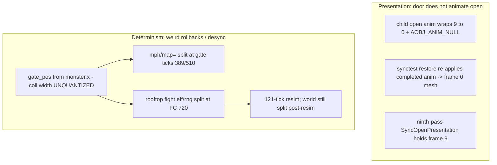

# Saffron City tower door + ground-monster rollback presentation

**Date:** 2026-05-31  
**Scope:** `port/net/sys/netrollbacksnapshot.c`, `port/net/sys/netsync.c`, `decomp/src/gr/grcommon/gryamabuki.c`, `scripts/netplay-trim-logs.py`  
**Status:** TWENTIETH PASS SHIPPED — **door-animation fix**: synctest verify-only probe was mutating the live gate DObj tree; guarded like Hyrule. Door now animates open under synctest. Soak pending

## Symptoms

Cross-ISA Saffron soak (`netplay-session-trimmed-saffron.log`):

- Tower door stayed visually closed while a rooftop Pokémon was already out after rollback synctest loads.
- Fighters physically collided with a closed door (yakumono id 3 at **960**) after synctest load at tick ~990 even though `status=Open` and the rooftop Pokémon was still alive.
- Charmander (Hitokage) flamethrower mouth texture / flame spawn timing inconsistent across loads (sim `item=` agreed; walk-out uses `dobj->anim_frame`).

`map=` never split in the log — sim gate scalars were fine; **gate GObj anim** and **item DObj anim** were not snapshotted.

## Root cause

1. **Forward sim:** spawn path needed explicit collision push (`gate_pos` / yakumono id 3) in addition to gate GObj anim.
2. **Hollow gate GObj after particle reset:** `syNetRbSnapResetParticlesForRollback()` leaves `gate_gobj` alive but `gobj->obj == NULL` (same class as DK Jungle tarucann). Every restore logged `restore_no_dobj` (126×, zero `restore_done`) — `AddAnimOpen` / `AddAnimClose` never ran.
3. **`gate_noentry` restore deadlock:** blob restored `gate_noentry=1` + `gate_pos=960` with `status=Open` and live monster. `SyncCollisionFromState` → `UpdateOpen` is a no-op when `gate_noentry==TRUE`, so collision stayed closed.
4. **Restore timing:** `ApplyGround` called restore before particle reset and before item apply; authoritative restore must run from `syNetRbSnapEnsureYamabukiGateAfterParticleReset` after items.
5. **Tower Pokémon items:** item blobs / hash omitted ground-monster anim fields (Charmander fire window keys off `dobj->anim_frame`).

## Fix

| Change                                                                                                                                 | Location                |
| -------------------------------------------------------------------------------------------------------------------------------------- | ----------------------- |
| `grYamabukiGateOpenForSpawn` in `MakeMonster` — open anim + SFX + **`SetPositionFar` + `UpdateYakumonoPos`** (yakumono id 3 collision) | `gryamabuki.c`          |
| Post-spawn `UpdateOpen` + yakumono push when monster item is live                                                                      | `gryamabuki.c`          |
| `grYamabukiGateSyncCollisionFromState` — restore/open paths re-sync collision from status + monster                                    | `gryamabuki.c`          |
| `grYamabukiGateRestoreAfterRollback` — anim scalars before re-seat; collision sync after status anim                                   | `gryamabuki.c`          |
| `OpenEntry` path calls `UpdateYakumonoPos` after moving gate far                                                                       | `gryamabuki.c`          |
| `grYamabukiGateRepairDObjTreeIfHollow` — rebuild gate DObj tree from `map_head` when hollow after particle reset                       | `gryamabuki.c`          |
| `grYamabukiGateUpdateOpenForRestore` — recompute collision from live monster on restore (ignores latched `gate_noentry`)               | `gryamabuki.c`          |
| `ApplyGround` Yamabuki — scalars only; defer anim/collision restore to `EnsureYamabukiGateAfterParticleReset`                          | `netrollbacksnapshot.c` |
| Debug: `SSB64_NETPLAY_YAMABUKI_GATE_DIAG=1` logs `gate_gobj`, `gate_dobj`, `gate_pos`, `yaku3`                                         | `gryamabuki.c`          |
| Extended Yamabuki ground blob: `gate_anim_frame`, `gate_anim_wait`; quantize `gate_pos` on capture/apply                               | `netrollbacksnapshot.c` |
| `syNetRbSnapEnsureYamabukiGateAfterParticleReset` — live ground-monster scan + gate repair; repair dispatch + post-item apply hook     | same                    |
| Item blob: `present_anim_frame/wait`, `texture_id_curr`, `SYNETRB_ITEM_FLAG_GROUND_MONSTER_ANIM_VALID` for ground monsters             | same                    |
| `syNetSyncFoldGroundMonsterItemExtras` (+ Hitokage flags/flame/offset) in rollback item hash                                           | `netsync.c`             |
| Quantize Hitokage `item_vars.hitokage.offset` on item canonicalize                                                                     | `netrollbacksnapshot.c` |

### Third pass (2026-05-31 — `netplay-session-trimmed-saffron.log`)

Soak still showed `restore_done tick=630 status=2 gate_pos=960 gate_noentry=1` with live `monster_gobj` right after first spawn synctest — forward `UpdateOpen` deadlocked on latched `gate_noentry`.

| Change                                                                                                                            | Location                |
| --------------------------------------------------------------------------------------------------------------------------------- | ----------------------- |
| `UpdateOpenForRestore`: clear `gate_noentry`, `SetPositionFar()` spawn beat, track monster, **never re-latch noentry on restore** | `gryamabuki.c`          |
| `RestoreAfterRollback`: clear `gate_noentry` when Open + live monster before collision sync                                       | same                    |
| `ApplyGround` Yamabuki: skip restoring `gate_noentry` from blob when Open + `monster_gobj_id != 0`                                | `netrollbacksnapshot.c` |
| `EnsureYamabukiGateAfterParticleReset`: clear `gate_noentry` after live monster resolve                                           | same                    |
| Export `GRYamabukiGateStatus` enum in `gryamabuki.h`                                                                              | same                    |

### Fourth pass (2026-05-31 — gate state never in cross-peer hash)

The earlier passes only fixed each peer's **local** restore/presentation. Re-reading the log against the workflow showed the actual desync is upstream: the two peers carry **different `monster_wait`** (host **1688** → item spawn tick **590**; guest **1417** → spawn tick **454**) from the same bootstrap seed. The rooftop Pokémon therefore emerges ~136 ticks apart and the door opens at different times — collision/anim restore can't reconcile a state the other peer never had.

Root cause: `gGRCommonStruct.yamabuki` (gate timer + door collision) was **never folded into `syNetSyncHashRollbackWorld`**, unlike Hyrule's twister (`syNetSyncFoldHyruleTwisterRollbackWorld`). The gate scalars _are_ in the rollback snapshot (survive local save/restore) but were never compared between peers, so a `monster_wait` drift — likely from the first RNG draw landing in the `intro_wait` window where synctest is skipped — went silent until the item/`eff`/`anim`/`map` partitions drifted at spawn.

| Change                                                                                                                                                                                                                     | Location    |
| -------------------------------------------------------------------------------------------------------------------------------------------------------------------------------------------------------------------------- | ----------- |
| `syNetSyncFoldYamabukiGateRollbackWorld` — fold `gate_status`, `gate_noentry`, `monster_wait`, `gate_wait`, `monster_id_prev`, quantized `gate_pos.x/y`, `monster_gobj->id`; mixed into world hash next to the Hyrule fold | `netsync.c` |

Effect: a divergent gate timer now surfaces as a `world=`/`map=` mismatch at the first post-intro synctest, forcing a rollback that re-converges the spawn schedule instead of letting it drift.

### Fifth pass (2026-05-31 — door collision opens but mesh stays visually closed)

After the collision fixes, fighters pass through the open doorway but the door **mesh never animates open** — it sits at the closed pose the whole time. The door visual is a played-out anim joint (advanced each frame by `gcPlayAnimAll`), separate from the yakumono-id-3 collision.

Root cause: snapshot capture/selection were fine, but `grYamabukiGateRestoreAfterRollback` re-seated the open joint via `grYamabukiGateAddAnimOpen()`, which calls `gcAddAnimJointAll(..., 0.0F)` — resetting the whole DObj tree to frame **0** (the closed pose of the open anim) and clobbering the `gate_anim_frame` restored two lines earlier. Under per-frame synctest rollback, the open anim is pinned at frame 0 every frame and never advances.

| Change                                                                                                                                                                           | Location       |
| -------------------------------------------------------------------------------------------------------------------------------------------------------------------------------- | -------------- |
| `grYamabukiGateReseatAnimOpenAtFrame(frame)` — PORT-only helper seats the open joint at the saved `gate_anim_frame` (vs hardcoded `0.0F`)                                        | `gryamabuki.c` |
| `RestoreAfterRollback` Open + Wait(open-entry) cases call the frame-aware seat when `has_restore_anim`; live spawn path keeps `0.0F` so a fresh spawn still animates closed→open | `gryamabuki.c` |

### Sixth pass (2026-05-31 — collision opens but door mesh still visually closed)

Frame-seating the root scalar wasn't enough: the door mesh stayed closed even though collision opened. The single root `anim_frame`/`anim_wait` scalars don't reproduce the door pose — the moving panel is a child DObj with its own cursor + AObj chain, and a re-seat from one root frame can't recover it (same class as DK Jungle barrel cannon / Sector Z Arwing presentation DObjs).

Robust fix mirrors the barrel cannon: capture the **full per-DObj anim runtime** (cursor `event32`, `anim_frame/wait/speed`, AObj chain) for the whole gate DObj tree into slot-local ring memory, and restore it verbatim after the tree repair + baseline re-seat.

| Change                                                                                                                                                                              | Location                |
| ----------------------------------------------------------------------------------------------------------------------------------------------------------------------------------- | ----------------------- |
| `SYNetRbSnapYamabukiGateBlob` (slot-local, not the 128-byte payload): array of `SYNetRbSnapDObjAnimBlob` for up to 8 gate DObjs                                                     | `netrollbacksnapshot.c` |
| `syNetRbSnapCaptureYamabukiGate` — walk gate tree via `gcGetTreeDObjNext` (same order as `gcAddAnimJointAll`), `syNetRbSnapCaptureDObjAnim` each node; called from snapshot capture | same                    |
| `syNetRbSnapApplyYamabukiGate` — re-walk repaired tree, `syNetRbSnapApplyDObjAnim` each node; called at end of `EnsureYamabukiGateAfterParticleReset` after `RestoreAfterRollback`  | same                    |
| Diag: `grYamabukiGateDiagLog` now logs `root_af/root_aw/child_af/child_aw` (door DObj anim cursor) to distinguish a frozen live anim from a restore/seat problem                    | `gryamabuki.c`          |

If a fresh soak shows `root_af`/`child_af` **frozen** (not advancing tick-over-tick) on the live peer, the remaining issue is the gate's live `gcPlayAnimAll` step not advancing during netplay sim (a live-sim bug, independent of snapshotting) — same documented failure mode as the Arwing.

### Seventh pass (2026-05-31 — confirmed live-anim freeze; door anim driven from the resim proc)

The sixth-pass diag confirmed the predicted live-sim failure. Fresh logs (`host.log`/`guest.log`) showed:

- `root_aw = AOBJ_ANIM_NULL` (`-3.4e38`) — the **root** DObj is not animated; the door panel is the **child** DObj (`child_aw=10`).
- `child_af` pinned at **0.00** at every sampled tick (`open_entry` 391, `spawn_done` 1093, restores through 1252) — the door mesh never advanced, exactly matching the on-screen frozen-closed door.

The capture/restore machinery (sixth pass) was structurally correct — `syNetRbSnapApplyDObjAnim` restores the child cursor/`event32`/AObj chain verbatim. The freeze was upstream: **the door anim never advanced in the live/resim sim**, so every captured frame was 0 and restore faithfully reproduced frame 0.

Root cause: the door anim was registered as a **separate priority-5 `gcPlayAnimAll` GObj process on the gate GObj** (`grYamabukiMakeGate`), distinct from the priority-4 ground proc (`grYamabukiGateProcUpdate`). Under rollback netplay the ground proc re-runs in lockstep with the resimmed sim (proven: `monster_wait` counts down across ticks), but the gate GObj's own process list does **not** advance the door across the resim cycle — so the open joint stayed at frame 0 forever.

Fix: drop the separate priority-5 process (PORT) and step the door anim **once per sim tick from the priority-4 ground proc** that already runs during resim. The door pose becomes a pure function of the snapshotted/hashed gate state and resim reproduces it deterministically. Offline behavior is unchanged (the ground proc runs every frame either way, and `gcPlayAnimAll` is the identical call).

| Change                                                                                                                                                                                                                                                                                          | Location                       |
| ----------------------------------------------------------------------------------------------------------------------------------------------------------------------------------------------------------------------------------------------------------------------------------------------- | ------------------------------ |
| `grYamabukiMakeGate` — `#ifndef PORT` guard around the priority-5 `gcAddGObjProcess(gate_gobj, gcPlayAnimAll, …)`; PORT no longer registers it                                                                                                                                                  | `gryamabuki.c`                 |
| `grYamabukiGateProcUpdate` — PORT: call `gcPlayAnimAll(gate_gobj)` at end of every tick (advances open/close anim in lockstep with the resim-running ground proc)                                                                                                                               | `gryamabuki.c`                 |
| `grYamabukiGateDiagLogProcAnimOnChange` — log `proc_anim` only when the child frame actually changes; samples the **live/resim-advanced** pose (vs `restore_done`, which always reads a freshly-seated frame 0)                                                                                 | `gryamabuki.c`                 |
| `netplay-trim-logs.py` — `YAMABUKI_GATE_RE`, `collapse_yamabuki_gate_lines` (collapse per-tick spam with identical gate/anim state), `collect_yamabuki_gate_summary` (open/spawn ticks, `child_af` min/max, frozen-door WARNING, `proc_anim` live-advance count); `--no-collapse-yamabuki-gate` | `scripts/netplay-trim-logs.py` |

Trim-script summary on the **old-binary** logs (pre-fix, for reference):

```
door child_af range: min=0.00 max=0.00
WARNING: door child_af never advanced past 0 — mesh stayed closed (anim frozen)
proc_anim samples: 0 (no live door-anim advance observed)
collapsed repeats: ... yamabuki_gate=102
```

After rebuilding `ssb64` and re-running with the new binary, the summary should instead report `proc_anim live-advance samples: N child_af 0.00..XX` and a non-zero `door child_af range`.

### Eighth pass (2026-05-31 — hold fully-open pose after completed open anim)

Post-spawn synctest restore (tick ~510 in `netplay-session-trimmed-saffron.log`) faithfully applied a **completed** open anim: `child_af=0`, `child_aw=AOBJ_ANIM_NULL`. `gcPlayDObjAnimJoint` is a no-op when `anim_wait == AOBJ_ANIM_NULL`, so the door mesh stayed at the closed frame-0 pose for the rest of `GateStatusOpen` even though the rooftop Pokémon was still alive. Forward sim had the same wrap (493→502: anim plays 1→9 then wraps to 0+NULL); synctest made it worse by re-applying that completed state on every verify-load.

Fix: while `GateStatusOpen` and the monster item is live, if the child door DObj has `anim_wait == AOBJ_ANIM_NULL` and `anim_frame` is below the fully-open frame (9), re-seat the open joint at frame 9, apply the pose once, and freeze the cursor there. Called from `grYamabukiGateProcUpdate` (after `gcPlayAnimAll`) and from `syNetRbSnapEnsureYamabukiGateAfterParticleReset` (after `syNetRbSnapApplyYamabukiGate`).

| Change | Location |
| ------ | -------- |
| `grYamabukiGateHoldOpenVisualIfLiveMonster` / `grYamabukiGateHoldOpenVisualAtEndFrame` | `gryamabuki.c` |
| ProcUpdate + EnsureYamabukiGate hooks | `gryamabuki.c`, `netrollbacksnapshot.c` |

### Ninth pass (2026-05-31 — collision-open presentation + synctest skip)

Eighth pass only held the open mesh during `GateStatusOpen` + live monster. Logs still showed:

- **Wait + far** (`gate_pos ≥ 1280`, post-`open_entry`, pre-spawn): collision open but mesh stuck at frame 0 after synctest restore.
- **`restore_done`** logged before blob apply/hold — misleading diagnostics.
- **`gate_noentry=1`** latched collision at 960 during Open when monster was at doorway.
- Synctest verify-load during fragile gate windows still ran particle-reset + DObj hollow/restore every ~120 ticks.

Fix:

1. **`grYamabukiGateSyncOpenPresentation`** — hold frame 9 whenever collision is open (`Open` + live monster **or** `Wait` + `gate_pos.x ≥ 1280`) and the child open anim is not actively playing (`anim_wait != AOBJ_ANIM_NULL` guard skips mid-playback).
2. **`grYamabukiGateFinalizeAfterSnapshotRestore`** — after DObj anim blob apply: clear `gate_noentry` when Open + live monster, `SyncCollisionFromState`, `SyncOpenPresentation`, log **`restore_final`** (post-apply truth).
3. **`RestoreAfterRollback`** — defer open-joint re-seat for Open / Wait+far; blob apply + finalize owns mesh pose (avoids re-seating at frame 0 before apply).
4. **`syNetRbSnapshotYamabukiGateSynctestFragile`** — skip periodic synctest verify-load while gate is in fragile windows (mirror Hyrule twister skip); reason **`yamabuki_gate`**.

| Change | Location |
| ------ | -------- |
| `SyncOpenPresentation`, `FinalizeAfterSnapshotRestore`, simplified `RestoreAfterRollback` | `gryamabuki.c` |
| ProcUpdate calls `SyncOpenPresentation`; Ensure calls `FinalizeAfterSnapshotRestore` | `gryamabuki.c`, `netrollbacksnapshot.c` |
| `syNetRbSnapshotYamabukiGateSynctestFragile` + skip in `SynctestShouldSkip` | `netrollbacksnapshot.c` |

### Tenth pass — cause review & gap closure (2026-06-01)

Review of `netplay-session-trimmed-saffron.log` against the Hyrule twister fix template (`docs/bugs/netplay_hyrule_twister_rollback_2026-05-29.md`). Separates **presentation** (door mesh/collision looks closed) from **determinism** (rollbacks/desync). No code changes in this pass — documents gaps and re-soak prerequisites for the next implementation pass.

#### 0. Test-validity blocker — mismatched binaries in current soak

The attached soak log was captured with **different gate code on host vs guest**:

| Signal | Host section (lines ~48–7221) | Guest section (lines 7222+) |
| ------ | ----------------------------- | ----------------------------- |
| `restore_final` | **0 lines** | **7 lines** (390, 630, 601, 720×2) |
| `SYNCTEST_SKIP reason=yamabuki_gate` | **0 lines** | **119 lines** (510–628) |
| Post-restore mesh | `restore_done` always `child_af=0.00` | `restore_final` sometimes `child_af=9.00` at Open |

`restore_final` and the `yamabuki_gate` synctest skip were added in the **ninth pass**. Host logging only `restore_done` means host ran a **pre-ninth-pass** build while guest ran ninth pass.

**Consequence:** host still runs destructive synctest verify-load + particle reset in the fragile Open window; guest skips. Peers execute different gate presentation logic and different rollback cadence — **cross-peer divergence in this log is partially self-inflicted**. All conclusions below assume a **matched ninth-pass binary on both peers** before implementing further fixes.

**Re-soak checklist (before gap fixes):**

1. Deploy the **same** `ssb64` build to host and guest (verify both log `restore_final` and `yamabuki_gate` skip).
2. `SSB64_NETPLAY_ROLLBACK_SYNCTEST=1 SSB64_NETPLAY_YAMABUKI_GATE_DIAG=1` on Saffron cross-ISA soak.
3. Trim with `scripts/netplay-trim-logs.py`; confirm **both** peers report `restore_final` and identical `first open_entry` / `first spawn_open` ticks.

#### 1. Two distinct problems



- **Presentation:** passes 7–9 fixed live anim advance (`proc_anim child_af 0..9` in trim summary). Remaining visual issue is **collision** (`gate_noentry` latch at tick 510 → `yaku3=960`) and **mesh at frame 0** after restore when ninth pass is absent (host in current log).
- **Determinism:** frame-commit **720** splits on `rng=` + `eff=` while `figh`/`world`/`item`/`inputs` agree — an effect/RNG consumer diverged during the rooftop Pokémon fight, not an input desync.

#### 2. Gap inventory (mapped to Hyrule lessons)

##### Gap A — unquantized gate collision derivation (highest priority)

**Hyrule parallel:** twister motion / `GetLR` / rider physics used raw libm → `eff`/`figh` drift; fixed with `grHyruleTwisterQuantizeCompareF32` under `syNetplaySimQuantizeActive`.

**Current code:** `grYamabukiGateUpdateOpen` and `grYamabukiGateUpdateOpenForRestore` derive:

```c
gate_pos.x = DObjGetStruct(monster_gobj)->translate.vec.f.x - ip->coll_data.map_coll.width;
```

with **raw f32** (`gryamabuki.c` ~315, ~427). `gate_pos` is quantized on snapshot save/apply (`ApplyGround` + `syNetplayQuantizeVec3f`), but the **live forward path is not**.

**Hash impact:** yakumono id 3 position lives in **`mph=`** via `syNetSyncHashMapCollisionKinematics()` — it hashes every yakumono DObj translate (`netsync.c` ~459–495), **not** in the separate Yamabuki gate fold. Sub-ULP cross-ISA drift in monster X or coll width → `map=`/`mph=` split.

**Log evidence:**

- tick **389** (closed Wait, pre-`open_entry`): `map=0x76FD73B7/0x22E673B7`, `world` agrees — likely yakumono translate drift (cam/anim also split; gate not yet open).
- tick **510** (Open + live monster): `map=0xA2141CAB/0xC4A1D65A`, `world=0x7A3CA668/0x9D39AED9` — gate collision + gate fold both diverge.

**Proposed closure:** add `grYamabukiGateQuantizeGatePosF32()` (mirror `grHyruleTwisterQuantizeCompareF32`) and apply to monster X, coll width, and resulting `gate_pos.x` in both `UpdateOpen` and `UpdateOpenForRestore` when `syNetplaySimQuantizeActive`.

##### Gap B — rooftop-fight RNG/effect divergence (actual desync trigger)

**Hyrule parallel:** "fold + quantize the sim path that feeds eff/figh before it blows up."

**Log evidence (tick 720):**

```
FRAME_COMMIT_STATE_DIVERGE validation=720
  figh/world/item AGREE; inp_local=inp_peer
  local rng=0x3A29A090 eff=0x145457E3 | peer rng=0xF396267F eff=0xCEC2CA48
```

Triggers **121-tick resim** (load_tick=599, mismatch_tick=600, target=721). Post-resim: `world=0x9D39AED9/0x51281802`, `mph=0xE8A89638/0x58C912B2`, `item=0x0916E411/0x811C9DC5` — resim does not fully converge gate/map/item state.

**Analysis:** ground-monster item extras (Hitokage flags, `flame_spawn_wait`, offset) are folded into **`item=`** hash (`syNetSyncFoldGroundMonsterItemExtras`, `netsync.c` ~2119) and **`item=` agreed** at FC 720 — so the split is **not** the rooftop item scalar blob. Likely culprits:

1. **Effect spawns** from Charmander flamethrower (`ithitokage.c`: `flame_spawn_wait` countdown → weapon/effect spawn; mouth texture keys off `dobj->anim_frame`).
2. **RNG draws** consumed at different ticks if upstream sim (Gap A gate/monster position, fighter status during platform fight) diverged earlier despite `world` agreeing at FC boundary.
3. tick **631** synctest: `effect_count` 8→2 after restore; `figh`/`anim`/`eff` LOAD_HASH drift — effect reconcile incomplete through particle reset.

**Proposed closure:** soak with `SSB64_NETPLAY_SNAPSHOT_ITEM_DIAG=1` + effect-count trace around ticks 504–720; identify first `eff=` divergence tick; fold effect-generator state for ground-monster weapons into rollback hash if missing; quantize Hitokage spawn paths if tied to unquantized anim/position.

##### Gap C — duplicate Ensure path (pre-item + post-item)

**Hyrule parallel:** per-tick repair guard (`s_syNetRbSnapHyruleTwisterRepairTick`) + Castle bumper resolved **only post-item**.

**Current code:** `syNetRbSnapEnsureYamabukiGateAfterParticleReset` is invoked **twice** per rollback load:

1. `syNetRbSnapRepairStageAfterParticleReset` → Yamabuki case (~9785) — **before** `syNetRbSnapApplyItems`.
2. Direct call in `syNetRbSnapshotFinalizeLoadFromSlot` (~11432) — **after** item apply (comment: monster gobj must be live).

Castle bumper follows pattern (2) only; Yamabuki incorrectly also runs (1). Pre-item Ensure runs when `monster_gobj` may still be unresolved → first restore uses blob id lookup miss / nil monster.

**Log evidence (tick 720 resim load):**

- `restore_done gate_pos=1600 monster_gobj=(nil)` — pre-item pass
- `restore_done gate_pos=960 monster_gobj=0x…` — post-item pass

Guest ninth pass adds `restore_final` with `child_af=9` on the post-item pass only.

**Proposed closure:** remove Yamabuki from `syNetRbSnapRepairStageAfterParticleReset` switch (keep only post-item Ensure at ~11432, matching Castle bumper). Optionally add per-tick dedup static (`s_syNetRbSnapYamabukiGateRepairTick`) if FinalizeLoadCoupling also calls RepairStage.

##### Gap D — hash partition coverage vs synctest skip

**Findings:**

| Hash partition | Gate-related content | Synctest skip protects? |
| -------------- | -------------------- | ----------------------- |
| **`mph=`** / `map=` | All yakumono DObj translates incl. id 3 (`syNetSyncHashMapCollisionKinematics`) | **No** — skip only during Open+live or Wait+far |
| **`world=`** | Gate scalars via `syNetSyncFoldYamabukiGateRollbackWorld` (status, noentry, waits, gate_pos, monster gobj id) | Partially — fold updates when gate state changes |
| **`item=`** | Ground-monster anim + Hitokage extras | N/A during gate-only windows |

- tick **389** drift is **closed Wait** (`gate_pos=960`, pre-`open_entry`) — **outside** `yamabuki_gate` skip window. `map=` split may be yakumono id 3 at rest + cam/anim presentation, not gate-open fragility. Fixing Gap A (quantize live derivation) is the right first response; widening skip to closed Wait is **not** recommended without evidence.
- Ninth-pass skip (510–628 on guest) correctly covers Open+live; does not prevent drift at 389 or post-monster-death 631.

##### Gap E — post-resim world/map non-convergence

**Findings:**

- `syNetSyncFoldYamabukiGateRollbackWorld` **is** mixed into `syNetSyncHashRollbackWorld()` (~799–802) and therefore feeds frame-commit **`world_digest`** (`netpeer_frame_commit.c`, `syNetSyncHashRollbackWorld()` at digest capture).
- Resim baseline at load_tick=599: `live world=0x9D39AED9 slot world=0x7A3CA668` — gate fold included in both but live vs slot disagree before replay starts.
- Post-resim: `world=0x9D39AED9/0x51281802` — replay changed world hash without matching peer. **`mph=` also splits** post-resim (`0xE8A89638/0x58C912B2`), confirming yakumono kinematics (Gap A) not just gate scalars.

**Proposed closure:** Gap A quantize first; re-verify resim convergence. If `world` still splits, audit whether `monster_wait` / gate timer RNG draws during replay match ring slot (fourth-pass world fold should catch timer drift earlier).

#### 3. Prioritized implementation order (next code pass)

| Priority | Gap | Action | Hyrule template |
| -------- | --- | ------ | --------------- |
| **0** | — | Matched ninth-pass re-soak | soak pass criteria |
| **1** | A | Quantize live `gate_pos` derivation | `grHyruleTwisterQuantizeCompareF32` |
| **2** | C | Yamabuki Ensure post-item only | Castle bumper pattern |
| **3** | B | Diagnose + fix eff/rng consumer (Hitokage flames) | eff/figh fold + quantize |
| **4** | D/E | Re-soak; only widen skip or extend fold if drift persists | twister lifecycle split |

#### 4. Presentation note — `gate_noentry` at spawn (superseded by eleventh pass)

At tick 510 the log shows `status=2 Open`, `gate_pos=960`, `gate_noentry=1` with live monster at doorway. This is **vanilla behavior**: `grYamabukiGateUpdateOpen` latches `gate_noentry=TRUE` when tracked collision X would go below 960 (~322). Restore clears it (`UpdateOpenForRestore`, `FinalizeAfterSnapshotRestore`), but forward sim re-latches on the next tick if the monster remains at the door. **Gameplay "closed door" at spawn is expected collision semantics**, not a restore bug — separate from mesh frame-0 presentation.

### Eleventh pass (2026-06-01 — post-spawn egress window)

Fresh matched-binary soak after Gap A/C fixes showed the rollback path was no longer the primary reason the tower door appeared shut:

- both peers logged `open_entry` at tick **391** with `gate_pos=(1600,360)`, `yaku3=(1600,360)`, and `gate_noentry=0`;
- `proc_anim` advanced the child door DObj from frame **1..9**;
- both peers spawned the rooftop Pokemon at tick **461**;
- `spawn_done` immediately snapped `gate_pos` / yakumono id 3 back to **960** and latched `gate_noentry=1`.

That means the remaining failure was a forward lifecycle issue: the first `grYamabukiGateUpdateOpen()` after `MakeMonster()` derived `monster.x - coll_width < 960` from the just-spawned ground monster and closed the collision wall before players could use the open doorway. This was not a rollback restore bug, and it happened even with `yamabuki_gate` synctest skips active.

Fix:

| Layer | Change |
| ----- | ------ |
| Forward lifecycle | On `MakeMonster`, reuse `gate_wait` while `status=Open` as a deterministic egress timer (`GRYAMABUKI_GATE_SPAWN_EGRESS_WAIT`). `UpdateOpen` keeps yakumono id 3 at 1600 and `gate_noentry=FALSE` until the timer expires. |
| Rollback state | No new field: `gate_wait` is already in `SYNetRbSnapGroundYamabuki` and folded into `syNetSyncFoldYamabukiGateRollbackWorld`, so the egress countdown saves, loads, and hashes with existing gate state. |
| Restore lifecycle | `UpdateOpenForRestore` honors nonzero Open-state `gate_wait` by keeping collision far without decrementing the timer during load/finalize. Forward sim owns the countdown. |
| Quantization | The post-egress tracked collision path still quantizes `monster_x`, `coll_width`, and resulting `gate_pos.x` under `syNetplaySimQuantizeActive()`. |

### Twelfth pass (2026-06-01 — condition-based egress close)

The next matched-binary soak showed the eleventh-pass spawn fix worked but the fixed-length egress window was still too short:

- `spawn_done` at tick **490** now stayed open: `gate_pos=(1600,360)`, `yaku3=(1600,360)`, `gate_wait=59`, `gate_noentry=0`;
- the child door DObj advanced to frame **9** while the Open-state timer counted down;
- by the tick **607** load verify, the saved slot was still `status=Open` with a live monster, but `gate_wait=0` and yakumono id 3 was already back at **960**;
- the soft LOAD_HASH verify then restored a closed `Wait` state at tick **608** because live sim had already ejected the monster.

Root cause: `gate_wait` was treated as the whole egress rule. Once it reached zero, `UpdateOpen` immediately trusted `monster.x - coll_width`; if that tracked edge was still below **960**, the old path clamped the wall to **960** and latched the gate closed.

Fix:

| Layer | Change |
| ----- | ------ |
| Forward lifecycle | `gate_wait` is now the **minimum** Open-state grace timer. After it reaches zero, `UpdateOpen` still holds yakumono id 3 at x **1600** and keeps `gate_noentry=FALSE` while the tracked monster edge is below x **960** (`egress_hold` diagnostic). |
| Restore lifecycle | `UpdateOpenForRestore` mirrors the same condition: Open + live monster + `tracked_x < 960` restores collision far instead of reconstructing an already-closed slot. |
| Rollback state | No new serialized field: the timer remains `gate_wait`; the extra hold is derived from live item pose/width, which is already restored before Yamabuki finalization. |
| Quantization | The tracked edge comparison still uses the quantized `monster_x` and collision width under `syNetplaySimQuantizeActive()`, so the hold/close boundary is shared cross-ISA. |

### Thirteenth pass (2026-06-01 — skip fragile probe slots; expose Hitokage flame state)

The next soak proved the twelfth-pass egress logic was active:

- `spawn_done` at tick **911** opened collision/mesh (`gate_pos=1600`, `yaku3=1600`, `gate_noentry=0`);
- `egress_hold` kept the wall far from tick **971** through **1029** while the monster had not cleared;
- the door only closed after periodic synctest loaded probe tick **1029**, verified a drift, then restored the captured emergency live state (`tick=4294967295`), which ejected the monster and finalized `status=Wait`, `gate_pos=960`.

Root cause: live-current `syNetRbSnapshotSynctestShouldSkip()` knew Yamabuki was fragile, but `syNetRbSnapshotSynctestShouldSkipProbeTick()` only checked generic multi-item/link-bomb/effect cases. A previous tick whose **slot** captured `Open + monster` was still round-tripped, so the emergency restore erased the open gate immediately after the otherwise-correct restore.

Fix:

| Layer | Change |
| ----- | ------ |
| Synctest probe selection | `syNetRbSnapshotYamabukiGateSlotSynctestFragile()` checks the saved ground payload. Probe slots with `Open + monster_gobj_id` or `Wait + gate_pos.x >= 1280` are skipped with reason `yamabuki_gate_probe`. |
| Emergency restore safety | By skipping the fragile probe before `syNetRbSnapshotCaptureLiveEmergency()` / load / restore, the verification path no longer applies the emergency current-state slot over an active Yamabuki gate. |
| Diagnostics | `SSB64_NETPLAY_YAMABUKI_GATE_DIAG=1` now emits `yamabuki_hitokage` lines for Charmander: item anim frame/wait, mouth texture id, `flags`, `flame_spawn_wait`, offset, live `nWPKindHitokageFlame` count, and effect-link counts. |

### Fourteenth pass (2026-06-01 — gate anim phase in rollback lifecycle)

The thirteenth-pass soak showed collision and sim anim cursors were correct (`proc_anim child_af 0..9`, `egress_hold` at frame 9), but the door still looked wrong on screen:

- **open_entry** at tick 391 moved collision to x **1600** while the mesh was still at frame **0**, then only ~9 ticks of open anim played;
- **spawn_open** at tick 463 called `AddAnimOpen()` again, snapping an already-open mesh back to frame **0** and replaying the open anim;
- after close, tick **631** had closed collision (`gate_pos=960`) with `child_af=9` (open mesh pose) for one tick before wrapping to **0** — no symmetric hold-closed helper.

Root cause: rollback treated door animation as implicit side-effects of `gate_status` / collision, not as a first-class lifecycle. `gate_anim_frame`/`wait` were snapshotted but **not folded into `world=`**, and restore blindly called `AddAnimClose()` on `Wait+near` instead of seating the close joint at the saved frame/phase.

Fix:

| Layer | Change |
| ----- | ------ |
| Anim phase enum | `GRYamabukiGateAnimPhase`: `Closed`, `Opening`, `OpenHeld`, `Closing` — live field in `GRCommonGroundVarsYamabuki`, serialized in `SYNetRbSnapGroundYamabuki.gate_anim_phase`. |
| World hash | `syNetSyncFoldYamabukiGateRollbackWorld` folds `gate_anim_phase` + quantized child `anim_frame`/`anim_wait`. |
| Forward lifecycle | `grYamabukiGateOpenForSpawn` skips `AddAnimOpen` when collision is already far and mesh is held open (or mid-open from `open_entry`). |
| Open presentation | unchanged `SyncOpenPresentation` + phase tracking via `SyncAnimPhaseFromLive`. |
| Close presentation | `grYamabukiGateSyncClosedPresentation` + `HoldClosedVisualAtEndFrame` mirror the open-side hold-at-frame-9 logic for closed Wait+near. |
| Restore seating | `grYamabukiGateRestoreAfterRollback(..., phase, ...)` seats open/close joints by phase; `ReseatAnimCloseAtFrame` replaces blind `AddAnimClose` on restore. |
| ProcUpdate | after `gcPlayAnimAll`: `SyncOpenPresentation`, `SyncClosedPresentation`, `SyncAnimPhaseFromLive`. |

#### Yamabuki door / yakumono lifecycle

The Saffron tower door has three independent layers that must be kept in sync:

| Layer | Owner | What it controls | Rollback handling |
| ----- | ----- | ---------------- | ----------------- |
| Gate scalar state | `gGRCommonStruct.yamabuki` | `gate_status`, `gate_noentry`, `monster_wait`, `gate_wait`, `monster_id_prev`, `gate_pos`, **`gate_anim_phase`** | `SYNetRbSnapGroundYamabuki`; folded into `world=` via `syNetSyncFoldYamabukiGateRollbackWorld` |
| Collision wall | yakumono id 3 | `gate_pos` pushed through `mpCollisionSetYakumonoPosID(3, ...)`; closed = x 960, open = x 1600 | captured in map yakumono kinematics/anim; contributes to `map=`/`mph=` |
| Door mesh | `gate_gobj` DObj tree | child DObj open/close joint frames (`child_af` in logs) + **anim phase** | slot-local `SYNetRbSnapYamabukiGateBlob` plus `SyncOpenPresentation` (hold frame 9) and `SyncClosedPresentation` (hold frame 0) |

Lifecycle:

1. **Sleep -> Wait:** first active frame seeds `monster_wait = rand(1000) + 1000`; `gate_wait` starts at 1.
2. **Open entry:** when `gate_wait` reaches zero, `grYamabukiGateAddAnimOpenEntry()` clears `gate_noentry`, starts the open anim (or holds open if already far), and moves yakumono id 3 to x 1600. Phase → `Opening`.
3. **Pre-spawn open window:** `Wait + gate_pos >= 1280` is collision-open and presentation-open (`OpenHeld` after anim completes); synctest should skip the fragile restore probe here.
4. **Spawn:** `MakeMonster()` calls `grYamabukiGateOpenForSpawn()` — **does not restart open anim** if mesh is already held open from open_entry — switches to `Open`, clears `gate_noentry`, and starts the minimum Open-state egress timer in `gate_wait`.
5. **Minimum egress:** while Open-state `gate_wait > 0`, forward sim keeps yakumono id 3 at x 1600 and does not latch `gate_noentry`. The timer is snapshotted/hashed but only decremented by forward `UpdateOpen`.
6. **Clearance hold:** after the timer reaches zero, Open-state collision still stays far while the quantized tracked edge (`monster.x - coll_width`) is below x 960. This prevents the wall from closing through the monster while it is still occupying the doorway.
7. **Tracked close:** once the tracked edge reaches x 960 or beyond, `UpdateOpen` tracks it on the quantized grid, clamps to [960, 1600], and only then may close the wall behind the monster.
8. **Reset:** when the monster item is gone, `SetClosedWait()` returns to Wait, sets `gate_wait=1000`, picks the next `monster_wait`, moves collision near, and plays the close anim (phase → `Closing`). After close completes, `SyncClosedPresentation` holds frame **0** (phase → `Closed`).

## Verification

### Prerequisites (fourteenth-pass soak)

- **Both peers on identical fourteenth-pass binary** — host and guest must both log `restore_final`, `SYNCTEST_SKIP reason=yamabuki_gate`, and `SYNCTEST_SKIP reason=yamabuki_gate_probe` during Open/Wait+far. Soak with mismatched builds invalidates cross-peer analysis.

### Functional soak (after fourteenth-pass anim phase)

Rebuild `ssb64` and re-run Saffron cross-ISA soak:

- Door opens (collision + anim) when Pokémon spawn and after synctest loads during `GateStatusOpen`.
- With `SSB64_NETPLAY_YAMABUKI_GATE_DIAG=1`:
  - `spawn_open`: `gate_pos.x` / `yaku3.x` ≈ **1600**; **`child_af` stays at 9** (no snap back to 0) when open_entry already held the mesh open
  - `spawn_done`: `gate_pos.x` / `yaku3.x` remains **1600** with Open-state `gate_wait > 0`, not immediate **960**
  - open_entry → proc_anim **1..9** once; spawn does **not** replay open from frame 0 when pre-spawn window already open
  - close window: proc_anim **1..9..0** with `gate_pos=960`; after close completes, mesh stays at **`child_af=0`** (not stuck at 9 with closed collision)
  - egress countdown: `gate_wait` decreases during Open while collision stays far; after it reaches zero, `egress_hold` keeps collision far until `monster.x - coll_width >= 960`
  - synctest restore: **`restore_final`** with `child_af=9` when collision open (not just pre-apply `restore_done`)
  - no **`yamabuki_gate`** synctest skip during Sleep/closed Wait; live skip active during Open + live monster and Wait+far
  - probe skip: previous-tick slots that saved Open + live monster or Wait+far log `SYNCTEST_SKIP reason=yamabuki_gate_probe` instead of `item apply tick=<probe>` followed by emergency `tick=4294967295` restore
  - tick ~607/630 load with live monster: `gate_noentry=0`, `gate_pos` / `yaku3` stay far while the tracked edge is below **960**, then track the monster once clear
- **Both peers spawn the rooftop Pokémon on the same tick** (`item_count transition` matches host/guest); `monster_wait` in `restore_done` agrees across peers.

### Fifteenth pass (2026-06-01 — held-pose reapply + monster/flame probe skip)

Fourteenth-pass soak (`netplay-session-trimmed-saffron.log`) confirmed sim cursors were correct (`child_af=9`, close 1→9→0) but the door mesh stayed invisible on screen. Charmander flames rendered during forward play but tick **627** hit `LOAD_HASH_DRIFT` (`eff=` mismatch) and ejected the monster when probe selection fell through after gate status left `Open`.

Root causes:

1. **Door mesh:** `gcPlayDObjAnimJoint` is a no-op when `anim_wait == AOBJ_ANIM_NULL`. `HoldOpenVisualAtEndFrame` / `HoldClosedVisualAtEndFrame` ran once at transition, but descriptor/tree resets each frame left the mesh at the closed pose while logs still showed `child_af=9`.
2. **Probe window:** `yamabuki_gate` / `yamabuki_gate_probe` skipped only during `Open + monster` or `Wait + far`. During tracked close and the Hitokage flame window (gate `Wait`, collision near, live monster + flame weapons), probe ticks with `item_count=0` or fewer captured effects still round-tripped and emergency-restored over live state.

Fix:

| Layer | Change |
| ----- | ------ |
| Open/closed presentation | `SyncOpenPresentation` / `SyncClosedPresentation` re-seat and replay the held joint **every tick** while collision matches and the anim is not actively playing (not only on first transition). |
| Gate diag | `yamabuki_gate` lines now log `phase=` and `child_tx=` (child DObj translate.x) to distinguish anim-cursor truth from mesh transform truth. |
| Synctest skip | `syNetRbSnapshotYamabukiMonsterLiveSynctestFragile()` — live ground monster on item link or live `nWPKindHitokageFlame` weapons → skip reason `yamabuki_monster`. |
| Probe skip | `syNetRbSnapshotYamabukiMonsterSlotSynctestFragile()` plus live monster/flame check → skip reason `yamabuki_monster_probe`; effect-count mismatch during live monster/flame window → `yamabuki_monster_effect_probe`. |
| Item restore | `syNetRbSnapApplyItemPresentation` calls `gcParseDObjAnimJoint` + `gcPlayDObjAnimJoint` for ground monsters (briefly unfreezes NULL-wait held frames). |

#### Fifteenth-pass soak criteria

- With `SSB64_NETPLAY_YAMABUKI_GATE_DIAG=1`: `child_tx` tracks open/close motion alongside `child_af` (not stuck at closed translate while `child_af=9`).
- `egress_hold` / `OpenHeld`: door visibly open on both peers through rollback resim.
- Close window: visible close anim; after complete, mesh stays closed (`child_af=0`, `child_tx` at closed pose).
- Charmander walk-out + flame window: `SYNCTEST_SKIP reason=yamabuki_monster` / `yamabuki_monster_probe` / `yamabuki_monster_effect_probe` instead of tick ~627 `LOAD_HASH_DRIFT` + monster eject.
- Post-restore: `yamabuki_hitokage` shows valid `anim_frame` / `texture_id` (not `-1` hollow item).
- Charmander fire mouth + flame cadence stable through synctest. If not, `yamabuki_hitokage` shows whether the problem is item logic (`flags`, `flame_spawn_wait`, `anim_frame`, `texture_id`) or projectile/effect restore (`flame_weapons`, effect-link counts).
- `map=` / `item=` remain clean; optional `SSB64_NETPLAY_SNAPSHOT_ITEM_DIAG=1`. A residual gate-timer drift now shows as a `world=`/`map=` mismatch (caught + rolled back) rather than a silent door desync.
- **No FC divergence on `rng=`/`eff=`** during rooftop fight (ticks 504–720) with agreed inputs.
- **No contradictory dual restore** at resim load (single post-item `restore_final` per tick, not pre-item `gate_pos=1600` + post-item `gate_pos=960`).
- Post-resim: `world=` and `mph=` converge (or soft-continue without 121-tick stall).

### Sixteenth pass (2026-06-01 — forced joint pose apply + held-pose split)

Fifteenth-pass soak (`netplay-session-trimmed-saffron.log`) showed sim cursors correct (`child_af` 1→9, `OpenHeld` at 9) but the door still did not **look** open. Close showed a broken effect only when restore fought live close at tick ~584 (`LOAD_HASH_DRIFT`, dual `restore_done`/`restore_final`). Diagnostic `child_tx` stayed **1026.37** for every line — GateOpen uses **TraI** (path interpolation), not TraX, so translate.x is not a mesh-motion probe.

Root causes:

1. **NULL-wait pose apply:** `HoldOpenVisual` called `gcParse` + `gcPlay` after seating, but `gcPlayDObjAnimJoint` is a no-op when `anim_wait == AOBJ_ANIM_NULL`. Per-tick `gcAddAnimJointAll` at frame 9 reset parser state without reliably writing TraI onto the DObj.
2. **Held vs transition:** Re-adding the open joint every tick during `OpenHeld` was unnecessary and may have prevented the interpolate table from settling; close looked better because the close joint only ran during the active 585–593 window + restore glitch.
3. **Probe gap ~584:** Slot captured `item_count=0` while live still had the tower Pokémon on the item link; applying the empty slot + effect drift restarted close mid-egress.

Fix:

| Layer | Change |
| ----- | ------ |
| Pose helper | `gcApplyDObjAnimJointPoseAtFrame(dobj, frame, freeze_wait_null)` in `objanim.c` — briefly unfreezes NULL-wait cursors, parse+play, re-freeze. |
| Gate hold | `ReapplyChildHeldOpenPose` / `ReapplyChildHeldClosedPose` use the helper; full `gcAddAnimJointAll` seat only on transition. `SyncOpenPresentation` / `SyncClosedPresentation` split held vs seat paths. |
| Gate diag | Log `child_t=(x,y,z)` and `child_rz=` (TraI / rotation probes; `child_tx` alone is insufficient). |
| Gate blob apply | `syNetRbSnapApplyYamabukiGate` calls pose helper on each animated DObj after blob restore. |
| Item restore | `syNetRbSnapApplyItemPresentation` uses the shared pose helper. |
| Synctest skip | `Open + gate_pos >= 1280` fragile (slot + live) without requiring live `monster_gobj` pointer; `yamabuki_monster_item_gap_probe` when slot `item_count=0` but item link still has ground monster; `yamabuki_gate_effect_probe` during open-collision fragile window. |

#### Sixteenth-pass soak criteria

- With `SSB64_NETPLAY_YAMABUKI_GATE_DIAG=1`: `child_t` and/or `child_rz` change during `proc_anim` open/close windows (not flat while `child_af` advances).
- `open_entry` → `egress_hold`: door **visibly** open on both peers; held open through rollback resim without per-tick joint re-seat flicker.
- Close: clean close anim without dual-restore fight (`restore_done`/`restore_final` agree on `child_af`); no `LOAD_HASH_DRIFT` + `item apply` at tick ~584 during egress.
- Skip reasons: `yamabuki_monster_item_gap_probe` / `yamabuki_gate_effect_probe` when applicable.

### Seventeenth pass (2026-06-01 — `netplay-session-trimmed-saffron.log` post–16th)

Sixteenth-pass soak: sim open anim correct (391–399, `child_t.z` → 319.80) but **egress_hold (484+)** showed `child_t.z` runaway (-166k → millions) while `child_af=9` — door mesh off-screen. Root cause: `SyncOpenPresentation` called `grYamabukiGateReapplyChildHeldOpenPose` every tick (parse+play on NULL-wait TraI joint without re-seat). At tick **543** rollback load applied `item_count=0` while ground blob still had live `monster_gobj_id` → Charmander ejected / hollow (`anim_frame=-1` at 544).

| Change | Location |
| ------ | -------- |
| `SyncOpenPresentation` / `SyncClosedPresentation`: return immediately when already in `OpenHeld` / `Closed` phase — no per-tick held reapply | `gryamabuki.c` |
| `HoldOpenVisualAtEndFrame` / `HoldClosedVisualAtEndFrame`: one-shot `ReseatAnimOpen/CloseAtFrame` + freeze child cursor (not `gcApplyDObjAnimJointPoseAtFrame` every tick) | same |
| `syNetRbSnapShouldPreserveYamabukiGroundMonsterOnApply` — skip eject when slot item list empty but Yamabuki ground blob still in monster egress (`Open` or far `Wait`) | `netrollbacksnapshot.c` |

#### Seventeenth-pass soak criteria

- `egress_hold`: `child_t.z` stays ~320 (not runaway); door visibly open through Charmander walk-out.
- No hollow hitokage (`anim_frame=-1`) immediately after rollback load during egress; `item_count=0` apply must not eject live tower Pokémon when ground blob says monster active.
- Charmander flames: only expected when spawn `flags` is WAIT/INSTANT (NONE is valid ~25% rolls).

### Eighteenth pass (2026-06-01 — door open invisible post–17th)

17th-pass soak: held `child_t.z` stable at egress, but **opening slide still invisible**. Sim `proc_anim` 391–399 correct; gap 400–452 had no gate rows while collision stayed open. Root cause: after `HoldOpenVisual` latched `OpenHeld`, **`gcPlayAnimAll` still ran every tick** and the NULL-wait open joint wraps frame 9→0 (closed mesh) while `SyncOpenPresentation` early-returned. `MeshIsHeldOpen` also returned TRUE on phase alone, so spawn skipped re-open when mesh had wrapped.

| Change | Location |
| ------ | -------- |
| `grYamabukiGateShouldStepDoorAnim` — skip `gcPlayAnimAll` when phase is `OpenHeld` or `Closed` | `gryamabuki.c` |
| `MeshIsHeldOpen` / `MeshIsHeldClosed` — require live frame threshold, not phase alone | same |
| `SyncOpenPresentation` / `SyncClosedPresentation` — re-seat on wrap drift (`open_held_repair` / `closed_held_repair` diag) | same |
| `OpenForSpawn` — if collision open but mesh not held open, `BeginAnimOpen()` (replay slide at spawn) | same |

#### Eighteenth-pass soak criteria

- After `open_entry` (391–399): door **visibly open** through 400–453 (not closed mesh with open collision).
- `open_held_repair` rare/zero once held stable; no `child_tz` runaway.
- Spawn with wrapped mesh replays open anim (`BeginAnimOpen`) instead of silent snap.

### Nineteenth pass (2026-06-01 — Venusaur projectiles + full-tree gate render diag)

18th-pass soak: door simulation correct, but two follow-ups:

1. **Venusaur razor leaves never rendered** (same class as the original Charmander-flame eject). The synctest fragility window was hardcoded to `nWPKindHitokageFlame` (0x1E) only, so during a rollback load while a Venusaur (`nWPKindFushigibanaRazor`, 0x1F) projectile was airborne the probe was **not** skipped — the empty/short slot round-tripped and ejected/desynced the razor weapon GObjs. Charmander was protected only by coincidence of its hardcoded kind.
2. **Door still not visibly opening despite correct sim cursors.** The single-node `yamabuki_gate child_*` diag samples only `root->child`; it cannot tell whether the node whose translate/anim advances is the same node that carries the visible display list, or whether the drawn node is `DOBJ_FLAG_HIDDEN`. Needed a full-tree dump to localize the render node.

Fix:

| Change | Location |
| ------ | -------- |
| `syNetRbSnapWeaponIsMonsterWeapon(kind)` — range predicate `nWPKindMonsterStart..nWPKindMonsterEnd` (0x17..0x1F) | `netrollbacksnapshot.c` |
| `syNetRbSnapshotCountLiveHitokageFlameWeapons` → `…CountLiveMonsterWeapons` (counts any tower-monster weapon, not just flame) | same |
| `syNetRbSnapshotYamabukiMonsterSlotSynctestFragile` — slot weapon check uses the range predicate (Venusaur razor now keeps the probe skipped) | same |
| `grYamabukiGateCountHitokageFlameWeapons` → `…CountMonsterWeapons` (diag `flame_weapons=` now counts every rooftop-Pokémon projectile) | `gryamabuki.c` |
| `grYamabukiGateDiagLogRenderTree(tag)` — walk full gate DObj tree (`gcGetTreeDObjNext`, ≤16 nodes); per node log `t`, `rz`, `af`/`aw`, `dl` (display list present), `mobj` (material present), `flags`, `anim_root` as `yamabuki_gate_node` lines | same |
| Trim script: parse/collapse/summarize `yamabuki_gate_node`; summary pinpoints the drawn node (`dl=1`), warns if the drawn node is HIDDEN or never moves (anim_frame & translate static) while the sim opened | `scripts/netplay-trim-logs.py` |

#### Nineteenth-pass soak criteria

- **Venusaur razor leaves render** through rollback loads (same as Charmander flames); `SYNCTEST_SKIP reason=yamabuki_monster*` covers the razor window, no `LOAD_HASH_DRIFT` + weapon eject while a razor is airborne.
- With `SSB64_NETPLAY_YAMABUKI_GATE_DIAG=1`, `yamabuki_gate_node` rows appear during open/close windows. Trim summary should show the `dl=1` node and whether `af_moves`/`t_moves` is set on it during `open_entry`→`egress_hold`:
  - If the drawn node moves (`af_moves=1` or `t_moves=1`) but the door still looks closed on screen → renderer/matrix issue downstream of the DObj, not animation.
  - If the drawn node is static (`WARNING drawn node … never moved`) while another node animates → the open joint is on the wrong DObj (seat/joint targeting bug).
  - If `WARNING node … carries DL but is HIDDEN` → presentation hides the mesh; clear `DOBJ_FLAG_HIDDEN` on the open path.

### Twentieth pass (2026-06-01 — THE DOOR-ANIMATION FIX: synctest verify-only probe clobbered the live door)

**This is the pass that actually fixes the "gate won't animate open" symptom we chased from pass 5 onward.** The nineteenth-pass `yamabuki_gate_node` render diag proved the drawn door panels *do* animate (translate.z 0↔320, `anim_frame` 0→9, visibility flags toggling in sync) in forward sim and after real rollbacks — i.e. the animation/snapshot layer was already correct. The decisive clue came from the user: the door opens **offline** and with **`SSB64_NETPLAY_ROLLBACK_SYNCTEST=0`**, and *only* fails to open with synctest enabled.

Root cause — the periodic synctest probe (`syNetRollbackUpdate`, `netrollback.c`):

1. `syNetRbSnapshotCaptureLiveEmergency()` saves the live (open-door) state.
2. `syNetRbSnapRepairStageSetVerifyOnly(TRUE)` then `syNetRbSnapshotLoad(probe_tick)` + `syNetRbSnapRepairStageAfterParticleResetForTick(probe_tick)` loads an **old** slot and runs stage repair.
3. `syNetRollbackVerifyLoadedSlot` hashes it.
4. `syNetRbSnapshotRestoreLiveEmergency()` restores the live state.

The verify-only flag exists so step 2 does **not** mutate live objects the emergency blob still references. Hyrule's twister repair honors it (early-return with comment *"Any orphan eject, idle_clear, or MakeTwister here can destroy the mesh the emergency blob still references by id"*). **The Yamabuki gate repair never got that guard** — `s_syNetRbSnapRepairStageVerifyOnly` had exactly one consumer (Hyrule). So every verify-only probe ran the full presentation repair against the *old* slot:

- `grYamabukiGateRestoreAfterRollback` → `grYamabukiGateRepairDObjTreeIfHollow` can **rebuild the whole gate DObj tree** (`gcRemoveDObjAll` + `gcSetupCustomDObjs`, changing DObj pointers) and overwrites the live root/child `anim_frame`/`anim_wait` to the probe pose;
- `syNetRbSnapApplyYamabukiGate` + `grYamabukiGateFinalizeAfterSnapshotRestore` re-seat the door to the old pose and push collision from it.

`syNetRbSnapshotRestoreLiveEmergency()` could not reliably reverse this: once the gate latched `OpenHeld`, `grYamabukiGateMeshIsHeldOpen` trusts the restored `anim_frame=9` scalar while the rebuilt translate sits at the closed base, so `grYamabukiGateShouldStepDoorAnim` / `SyncOpenPresentation` see "held, nothing to do" and never recompute the pose. Result: door stuck visually closed under synctest; fine offline / synctest=0. (This also explains why the render diag looked clean — it samples from `ProcUpdate`/tagged events in forward sim, not in the transient post-probe window.)

Fix:

| Change | Location |
| ------ | -------- |
| `syNetRbSnapEnsureYamabukiGateAfterParticleReset` — early-return when `s_syNetRbSnapRepairStageVerifyOnly` is TRUE (mirrors the Hyrule twister guard); skips the live-tree-mutating `RestoreAfterRollback` / `ApplyYamabukiGate` / `FinalizeAfterSnapshotRestore` during synctest probes | `netrollbacksnapshot.c` |
| Optional `yamabuki_gate_repair … reason=verify_skip_all` diag under `SSB64_NETPLAY_YAMABUKI_GATE_DIAG=1` | same |

**Hash-safe:** every gate field folded into `world=` (`gate_status`, `gate_noentry`, `monster_wait`, `gate_wait`, `monster_id_prev`, `gate_pos.x/y`, `gate_anim_phase`, monster gobj id) is applied by `syNetRbSnapApplyGround`, which still runs in verify-only. Only the live child DObj `anim_frame`/`anim_wait` are sourced by the skipped repair, and those are static outside the ~9-tick open/close transitions (already covered by the `yamabuki_gate` synctest-skip window), so verify precision is preserved — the same tradeoff Hyrule already accepted.

#### Twentieth-pass soak criteria

- With `SSB64_NETPLAY_ROLLBACK_SYNCTEST=1`: the tower door **visibly animates open** (open_entry → held → close), matching offline / synctest=0 behavior. This is the primary pass/fail.
- `yamabuki_gate_node` (render diag): the `dl=1` panels stay at the open pose (`t.z≈320`, `af=9`) throughout the held window — no transient snap-to-closed after synctest probes.
- `yamabuki_gate_repair … reason=verify_skip_all` lines appear at probe ticks (confirming the guard fires); no `restore_done`/`restore_final` gate mutation logged at verify-only probe ticks.
- Cross-peer `world=`/`mph=` still converge; no new `SYNCTEST_FAIL` storm (rare, diagnostic-only fails during the open/close transition are acceptable).

### Twenty-first pass (2026-06-01 — held-pose drift guard: `MeshIsHeld*` trusted `anim_frame`, not the mesh)

The 20th-pass verify-only guard was necessary but **not sufficient**. A fresh soak (`netplay-session-trimmed-saffron.log`) plus direct user confirmation showed the door **collision opens (you can walk through) but the mesh renders a static closed door**, only under synctest; offline / synctest=0 it slides fine, and *other* stage hazards (Hyrule twister, Sector-Z Arwing, DK barrel cannon) animate correctly under synctest. Every sim-side diagnostic (`proc_anim`, `restore_done`/`restore_final`, full `yamabuki_gate_node` dump) shows the door at the **correct** translate (`child_t.z` 0→320 during open, ~320 held). So the gap is strictly between the (correct) sim write and the matrix build at draw time — and it is gate-specific.

Root cause — `grYamabukiGateMeshIsHeldOpen` / `grYamabukiGateMeshIsHeldClosed` decided "the mesh is already held, skip the re-seat" from **`child->anim_frame` alone** (`>= 8.5` open / `<= 0.5` closed). The gate is the *only* hazard that skips `gcPlayAnimAll` while held (`grYamabukiGateShouldStepDoorAnim`), so its `translate` is "sticky" rather than recomputed every frame. Under rollback the gate DObj tree gets torn down + rebuilt to its `DObjDesc` **base pose** (particle reset → `RepairDObjTreeIfHollow` → `gcSetupCustomDObjs`) on real loads, while `anim_frame`/`anim_wait` are restored separately via the world fold. That leaves `anim_frame=9` with `translate` at the wrong pose → `MeshIsHeldOpen` returns TRUE → `SyncOpenPresentation` early-returns → the door is **never** re-seated and renders statically closed for the whole held window. The 18th-pass repair only triggered on **frame wrap** (`af` 9→0), never on **translate drift** (`af` stays 9, translate moves), so it missed this.

Fix — verify the *pose*, not just the frame:

| Change | Location |
| ------ | -------- |
| `grYamabukiGateHeldPoseTzMatches(live_tz, ref_tz)` + `sGRYamabukiGateHeldOpenRefTz` / `sGRYamabukiGateHeldClosedRefTz` (tol `32.0`) — held only if live `translate.z` is within tolerance of the captured held pose | `gryamabuki.c` |
| Capture the held-pose reference at the authoritative seat points: `HoldOpen/ClosedVisualAtEndFrame` and the natural settle in `SyncAnimPhaseFromLive` (which runs *after* `SyncOpen/ClosedPresentation`, so the value is already repaired) | same |
| `SyncOpenPresentation` / `SyncClosedPresentation` — in the `OpenHeld`/`Closed` branch, fall through to the one-shot re-seat (`HoldOpen/ClosedVisualAtEndFrame`) when the pose has drifted from the reference (`open_held_pose_drift` / `closed_held_pose_drift` diag); legacy frame-only behavior preserved on non-`PORT` and when no reference is captured yet | same |
| **Draw-time probe** `grYamabukiGateDrawWithDiag` (registered as the gate display proc under `PORT`) → `yamabuki_gate_draw` + `tag=draw` node lines logged from the priority-6 display proc on the *actually-drawn* GObj, throttled to translate.z changes; first diagnostic that samples render-time pose (all prior diags are `ProcUpdate`/sim-side) and also catches "drawn gobj != struct gate_gobj" | same |

**Hash-safe:** `translate` is *not* cross-peer hashed — the world fold carries `gate_anim_phase` + quantized `anim_frame`/`anim_wait` only (14th pass), and the re-seat leaves all of those unchanged (`af=9`/`aw=NULL` already). The drift re-seat is pure presentation, fires at most once per drift event (post-seat translate is back within tolerance), and cannot runaway like the 17th-pass per-tick `gcApply` because it uses the one-shot `gcAddAnimJointAll`+`gcPlayAnimAll` seat only when drift is detected.

#### Twenty-first-pass soak criteria

- With `SSB64_NETPLAY_ROLLBACK_SYNCTEST=1`: the tower door **visibly animates open and stays open** while the Pokémon is out, then closes — matching offline. Primary pass/fail.
- With `SSB64_NETPLAY_YAMABUKI_GATE_DIAG=1`: `yamabuki_gate_draw` / `tag=draw` lines now appear (draw-time). Compare to `proc_anim` for the same tick:
  - **draw `child_tz` == proc `child_t.z`** → the fix holds end-to-end; if the door ever still looks closed the gap is downstream of the DObj (matrix/DL/GPU), not the pose.
  - **draw `child_tz` ≈ base/0 while proc shows ~320** → drift guard isn't catching that path; widen the capture/trigger.
  - **`drawn_gobj != struct_gobj`** → a stale/duplicate gate GObj is on the render link (different bug than this pass).
- `open_held_pose_drift` lines should appear right after rollback loads during the held window (the guard firing), then the draw pose tracks the open pose for the rest of the window.
- Cross-peer `world=`/`mph=` still converge; no new `SYNCTEST_FAIL` storm.

### Twenty-second pass (2026-06-01 — tower-monster flames render again: re-emit particles after the rollback wipe)

User report: under synctest the Charmander flame **hit fighters but rendered nothing**. Same sim-correct / render-missing signature as the door, one layer down.

Root cause — the flame weapon (`nWPKindHitokageFlame` 0x1E; `nWPKindLizardonFlame` 0x19 is byte-identical) is **collision-only**: its `WPDesc` render-flags field is `0x00` and the entire visible fire is `lbParticle`s spawned **once** at weapon creation (`itHitokageWeaponFlameMakeWeapon`, scripts 2 + 0 on `gITManagerParticleBankID | GENLINK(0)` at the weapon's translate/velocity). Every rollback load runs `syNetRbSnapResetParticlesForRollback()` → `lbParticleEjectStructAll()` + `lbParticleEjectGeneratorAll()`, globally wiping all particles. Each particle-dependent stage hazard has a dedicated `…EnsureAfterParticleReset` rebuild — **the monster flame had none**. So after the first rollback the weapon GObj survived (hitbox kept connecting) while the particle visual was gone for good. The log corroborates: `wpn=0x811C9DC5/0x811C9DC5` and `eff=0x811C9DC5/0x811C9DC5` on every `LOAD_HASH_DRIFT` (both the FNV-empty basis — weapons/effects/particles aren't hashed, so nothing forces a rebuild).

Fix:

| Change | Location |
| ------ | -------- |
| `itHitokageReemitFlameParticles(weapon_gobj)` (PORT) — re-spawns the scripts-2/0 flame particles at the weapon's current translate/`vel_air`; serves both Hitokage and Lizardon (identical spawn) | `decomp/src/it/itground/ithitokage.c` (+ header decl) |
| `syNetRbSnapEnsureMonsterFlameParticlesAfterParticleReset()` — walks the weapon link and re-emits for `nWPKindHitokageFlame`/`nWPKindLizardonFlame`; called from `syNetRbSnapApplySlotToLive` right after `syNetRbSnapApplyWeapons` (so the restored flame GObjs exist) | `port/net/sys/netrollbacksnapshot.c` |

**Hash-safe:** `lbparticle.c` redefines its RNG to the **cosmetic** stream (`syUtilsRandFloatCosmetic` / `…IntRangeCosmetic`), so re-emitting does not advance gameplay RNG, and particles are not folded into any rollback hash. Pure presentation. Other monster projectiles (Iwark rock, Nyars coin, Spear swarm, Kamex hydro, Starmie swift, Dogas smog, Fushigibana razor) render via their own meshes/particles and are intentionally untouched — extend the kind list if any of them surface the same invisible-but-hits symptom.

#### Twenty-second-pass soak criteria

- With `SSB64_NETPLAY_ROLLBACK_SYNCTEST=1`: Charmander/Charizard flames **visibly render** through rollbacks (not just connect). Primary pass/fail.
- No change to flame collision timing/damage (the re-emit touches particles only); cross-peer `world=`/`rng=` still converge.

### Twenty-third pass (2026-06-01 — THE static-closed-door root cause: gate GObj re-resolved by shared `id`)

The 21st-pass held-pose drift guard was **the wrong layer** and did not fix the door. A fresh soak (with the 21st-pass draw probe live) proved it:

- **Sim is correct.** `proc_anim` walks `child_t.z` 0→320 (open) and holds 320; the new `closed_held_pose_drift` guard fires correctly at tick 809 (re-seats a sim tree that sat at `t.z=294` while phase=Closed). The world/anim state is right.
- **Render is frozen.** `yamabuki_gate_draw` logs appear **only for ticks 0–11** (startup close), then never again — the drawn pose is stuck at `-0.00` for the rest of the match.
- **The gate GObj identity splits.** Draw probe (ticks 0–10): `gate_gobj=…468`, `gate_dobj=…550`. From tick ~390 on, `proc_anim` shows `gate_gobj=…340`, `gate_dobj=…a00`. `…468` is never referenced again. `open_held_pose_drift` never fires (the *sim* tree it guards is already fine); `closed_held_pose_drift` fires 22× (also on the sim tree).

Root cause — `gate_gobj` is captured/restored across rollback as `gobj->id` (`syNetRbSnapGobjId` returns `gobj->id`), but `gcMakeGObjSPAfter` stamps **every** ground GObj with `id == nGCCommonKindGround` (1010). This stage has **two**: the bare ground controller (`grYamabukiMakeGround` — priority-4 `grYamabukiGateProcUpdate`, **no display proc, no DObj tree**) and the gate (`grYamabukiMakeGate` — priority-6 display proc `grYamabukiGateDrawWithDiag` + door DObj tree). `gcFindGObjByID(1010)` is order-dependent and re-resolves `gate_gobj` to the **controller**. The restore then runs `grYamabukiGateRepairDObjTreeIfHollow`, which sees the controller has no tree and **builds a phantom door tree on it** (`gcRemoveDObjAll`+`gcSetupCustomDObjs` → new `dobj=…a00`). From then on the sim animates that invisible controller GObj (no display proc) while the **real gate** (`…468`, the only GObj with the display proc) is orphaned, rendering its last (startup-closed) pose forever. Collision still works because it is driven by world state (`gate_status`/`gate_pos`/yakumono), not the GObj. This is the same shared-`id` / `gcFindGObjByID` hazard already documented for the Peach's-castle bumper and the Hyrule twister.

Fix — resolve the gate from the live ground link by its **display proc**, never by `id`:

| Change | Location |
| ------ | -------- |
| `grYamabukiGateResolveLiveGObj()` (PORT) — walks `gGCCommonLinks[nGCCommonLinkIDGround]` and returns the GObj whose `proc_display == grYamabukiGateDrawWithDiag` (unique to the gate; the controller never gets `gcAddGObjDisplay`). Logs `yamabuki_gate_resolve` when the resolved identity changes | `gryamabuki.c` (+ header decl) |
| Both rollback restore sites now prefer the resolver and fall back to `gcFindGObjByID(gate_gobj_id)` only if no gate GObj is on the link: `syNetRbSnapApplyGround` (`nGRKindYamabuki` case) and `syNetRbSnapEnsureYamabukiGateAfterParticleReset` | `netrollbacksnapshot.c` |
| Draw probe throttle widened: `grYamabukiGateDiagLogDrawTree` now also fires on **drawn/struct GObj identity change**, emitting `yamabuki_gate_draw_identity` (with both `proc_display` pointers + `drawn_eq_struct`). The tz-only throttle had hidden the frozen orphan for two passes | `gryamabuki.c` |

With the resolver in place `gate_gobj` always points at the rendered gate, so `RepairDObjTreeIfHollow` runs on a GObj that already has a tree (never builds the phantom controller tree), and the priority-4 `ProcUpdate` animates the GObj that the priority-6 display proc draws. The 21st-pass held-pose guard is retained — it is still correct for genuine translate drift on the *right* GObj — but it is no longer load-bearing for this bug.

**Hash-safe:** no hashed field changes. The resolver only re-points a GObj* the same way `gcFindGObjByID` did, but to the correct object; `proc_display` and link identity are not part of any rollback hash. The new diagnostics are gated by `SSB64_NETPLAY_YAMABUKI_GATE_DIAG=1`.

#### Twenty-third-pass soak criteria

- With `SSB64_NETPLAY_ROLLBACK_SYNCTEST=1`: the tower door **visibly slides open/closed**. Primary pass/fail.
- With `SSB64_NETPLAY_YAMABUKI_GATE_DIAG=1`:
  - `yamabuki_gate_draw` lines now continue **past tick 11** and track the open pose (`child_tz` → ~320) during the open window — the drawn GObj animates.
  - `yamabuki_gate_resolve … struct_was_correct=0` may appear at the first post-startup rollback (the moment the old code would have bound the controller); after the fix the resolver corrects it and `drawn_eq_struct=1` should hold in `yamabuki_gate_draw_identity`.
  - No `yamabuki_gate_draw_identity … drawn_eq_struct=0` persisting across the open window (would mean a second gate GObj still on the render link).
- Cross-peer `world=`/`mph=` still converge; no new `SYNCTEST_FAIL` storm.
