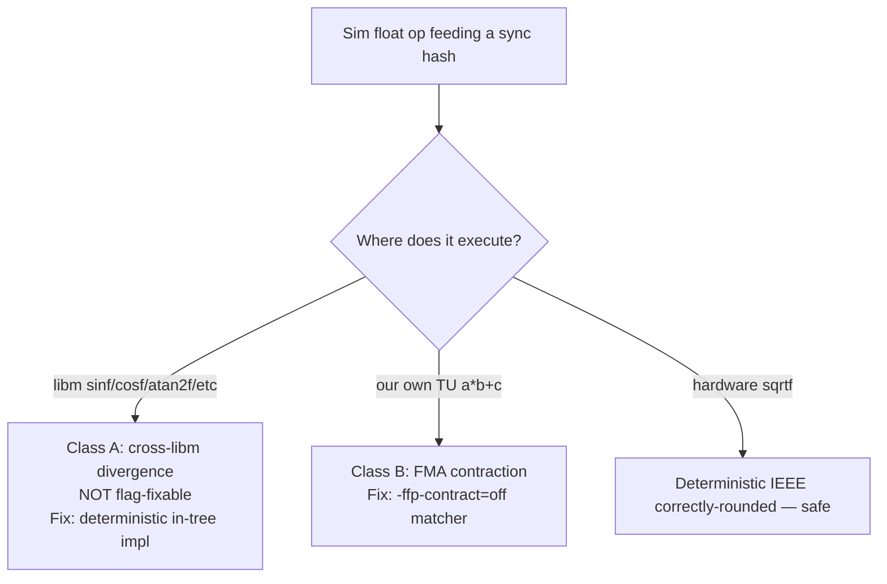

# Cross-ISA float determinism — netplay playbook

Reusable reference for N64 decomp netplay mods: why aarch64↔x86_64 (and bionic↔glibc) peers diverge on matched inputs, how to classify the failure, and what to fix.

**Related fixes:** [netplay_cross_isa_determinism_2026-05-27.md](bugs/netplay_cross_isa_determinism_2026-05-27.md), [netplay_cross_isa_libm_trig_2026-06-04.md](bugs/netplay_cross_isa_libm_trig_2026-06-04.md), [netplay_thrown_item_world_pose_fma_2026-05-30.md](bugs/netplay_thrown_item_world_pose_fma_2026-05-30.md), [netplay_link_bomb_rollback_2026-05-29.md](bugs/netplay_link_bomb_rollback_2026-05-29.md).

---

## Two-class taxonomy

Every float that feeds a rollback / frame-commit sync hash must be classified before choosing a fix.

| Class | Mechanism | Compile-flag fix? | Fix |
|-------|-----------|-------------------|-----|
| **A — cross-libm** | `__sinf`/`__cosf` (etc.) resolve to **platform** `libm` (bionic vs glibc). Different algorithms → different last ULP. Quantize grid can **straddle** (peers snap to different cells). | **No** — math is in precompiled `libm.so` | Route to **one in-tree implementation** (decomp N64 polynomial, netmenu-gated). |
| **B — FMA contraction** | Clang/GCC may fuse `a*b+c` to one FMA on aarch64 while x86_64 uses two rounded ops. | **Yes** — `-ffp-contract=off` on the TU | Add TU to matcher in `CMakeLists.txt`. |
| **Safe — hardware sqrt** | `sqrtf` is IEEE-754 correctly-rounded on both ISAs. | N/A | Usually no action; still quantize at hash boundaries if needed. |

**Rule:** Any transcendental on a **sync path** must run a **single in-tree implementation**. Any `a*b+c` on a **sync path** must compile with **contraction off**.

---

## Detection signature

Typical cross-ISA desync from float drift:

1. **Matched inputs** at frame commit (`inp` token agrees).
2. **Coarse tokens may still match** (`world`, `rng`, `eff`) while a finer token splits (`figh`, `item`, `map`).
3. **Same-ISA peers stay clean** (Linux↔Linux OK; Android↔Linux fails).
4. **First measurable fork** often in velocity / collision / orientation after trig or matrix math (e.g. PK Thunder jibaku `vel_air` differs in the 4th decimal before quantize snap).
5. **Rollback reanchor does not reconverge** — replay re-seeds the same nondeterminism.

Use synctest + `SSB64_NETPLAY_SIM_F32_QUANTIZE=0` on **both** peers only to **reproduce** drift (not for production).

### Naming the diverging fighter field

When a `FRAME_COMMIT_STATE_DIVERGE` shows a `figh` split with matched inputs (e.g. DK cargo-carry, 2026-06-29), `syNetRollbackOnPeerFrameCommitStateMismatch` drills the `figh` partition the same way it always did for `item`/`rng`:

- `syNetSyncLogFighterSlotHashes(snap_tick)` — per-slot fighter hashes; **compare host vs guest logs side by side** to localize *which player* forked (captor vs captive). Gated by `SSB64_NETPLAY_FIGHTER_SLOT_HASH_LOG=1` (optionally windowed with `SSB64_NETPLAY_FIGHTER_SLOT_HASH_TICK_MIN`/`_MAX`).
- `syNetRbSnapshotLogFighterFieldDiffAtTick(snap_tick, "frame_commit_figh_diverge")` — names the field. Gated by `SSB64_NETPLAY_SNAPSHOT_FIGHTER_FIELD_DIFF=1` (set on both peers).

> Env-var names above are the **actual** strings the code reads (`port/net/sys/netsync.c` `syNetSyncFighterSlotHashLogEnabled`, `port/net/sys/netrollbacksnapshot.c` `syNetRbSnapFighterFieldDiffEnabled`). An earlier revision of this doc listed `SSB64_NETPLAY_FIGHTER_FIELD_DIFF`, which does **not** exist — that typo is why the first instrumented soak emitted no field lines.

#### Capture the *seed* tick, not the cascade tick

`syNetRollbackOnPeerFrameCommitStateMismatch` fires at the **validation frontier** (post-cascade): by then every fighter field already differs, so the drill-down at `snap_tick = validation_tick - 1` only confirms "DK and Link both forked", not the origin. The authoritative origin is `mismatch_tick` — one tick after the last *agreed* state (`FRAME_COMMIT_INPUT_AGREE_REANCHOR ... last_agreed=N mismatch=N+1`).

`syNetRollbackHandleFrameCommitStateMismatchCore` now also dumps `syNetRbSnapshotLogFighterFieldDiffAtTick(mismatch_tick, "frame_commit_seed")` for the **inputs-agree** case. Because the recovery resim is *deferred* (armed in that same function but run later), `slot[mismatch_tick]` still holds the **forward-sim** blob when the dump runs, so the `blob_*` columns are each peer's pre-divergence state at the seed tick. Compare the two peers' `frame_commit_seed` blocks: at a clean 1-tick fork only the genuinely diverging field(s) differ in the `blob=` columns (ignore `live=`, which is the current frontier state, not the seed). Gated by `SSB64_NETPLAY_SNAPSHOT_FIGHTER_FIELD_DIFF=1`.

### DK cargo-carry fork (2026-06-29) — what the static trace ruled out

The 2026-06-29 soaks fork at a single tick (`baseline matched load_tick=720 figh=0x… → mismatch=721`) inside a DK cargo-carry **fall** (`nFTDonkeyStatusThrowFFall`, `ga=air`, carrying Link `nFTCommonStatusShouldered`). Synctest is clean on each peer (same-machine save/reload self-consistent), so this is a genuine **cross-peer** per-tick divergence, not a restore/coupling-fidelity gap.

A read-only trace of the cargo path ruled out the two leading hypotheses:

- **Not `sys/matrix.c`.** The captive's synced root translate is derived from a captor joint world matrix (`ftCommonCapturePulledProcPhysics` → `gmCollisionGetWorldPosition`), but the entire build chain — `gmCollisionTransformMatrixAll`, `func_ovl2_800ED490`, `func_ovl2_800EDBA4`, `gmCollisionGetWorldPosition` — lives in `decomp/src/gm/gmcollision.c`, which is **already** `-ffp-contract=off`. `sys/matrix.c` only builds camera/projection/lookat matrices, not joint world transforms. Adding it to the matcher would not touch this path.
- **Not a libm transcendental.** The joint rotation uses `lbCommonSin`/`lbCommonCos` (`decomp/src/lb/lbcommon.c`), which are **sine-table lookups** (`dLBCommonSinLookup`), not `sinf`/`cosf`. Bit-deterministic across ISAs.

So the obvious contraction/libm culprits are all covered. The seed is some other per-tick op in the cargo-fall; capture it with the `frame_commit_seed` dump above (re-soak the DK-carry repro with `SSB64_NETPLAY_SNAPSHOT_FIGHTER_FIELD_DIFF=1` and `SSB64_NETPLAY_FIGHTER_SLOT_HASH_LOG=1` on both peers), then classify the named field.

**Partial resolution (2026-06-29, phase 1):** the joint-rotate pose leak was real and is fixed, but it was **not the whole story**. The fork field for the *pose* leak is the **child-joint rotate** (`fhash_full`/`anim_hash` diverge while `status_id`/`motion_id` agree). The in-sim quantize was incomplete: `gcPlayDObjAnimJoint` snaps a joint's pose only when its figatree track advances that frame, and `syNetplayCanonicalizeFighterSimState` snapped the **root** rotate but for **child joints only translate** (rotate/scale covered only by the intro/appear-scoped pass). A statically-held or coupling-posed joint (the DK cargo pose, the Shouldered captive) therefore kept a raw cross-ISA rotate mid-match that leaked into `fhash_full` and the raw-captured snapshot blob → FC `fighter_digest` fork. Fix: child-joint loops in `syNetplayCanonicalizeFighterSimState` now call `syNetplayQuantizeDObjAnimPose` (translate+rotate+scale) every accepted sim boundary for all fighters. See [`docs/bugs/netplay_fighter_child_joint_rotate_quantize_2026-06-29.md`](bugs/netplay_fighter_child_joint_rotate_quantize_2026-06-29.md). Lesson: a `figh` fork with matching `status`/`motion` but diverging `fhash_full`/`anim_hash` is a **pose-quantization gap**, not necessarily a contraction/libm gap — check the live-sim canonicalize coverage before touching the matcher.

**Phase 2 (2026-06-29, OPEN — DK cargo-carry landing fork):** after the pose fix, the DK cargo soak survives further into the carry but still forks. New per-tick `fighter_cargo_diag` instrument (`SSB64_NETPLAY_FIGHTER_CARGO_DIAG=1`, in `syNetRbSnapshotLogFighterCargoWalkDiag`, emitted at the per-tick forward save) localized the **true fork to tick 636** (the FC reanchor `mismatch=601` is a heuristic). At 636, DK is bit-identical cross-peer through tick 635, and at 636 **Linux lands** (`242 ThrowFLanding`, `ga`→ground) while **Android stays airborne** (`241 ThrowFFall`) — with logged position/velocity/`floor_dist`/`floor_flags` all bit-identical. So the divergence is the **landing decision** `mpCommonCheckFighterLanding` → `mpCollisionCheckFloorLineCollisionSame` → `mpCollisionCheckFCSurfaceFlat` / `…SurfaceTilt`. Both intersection helpers have contraction-fragile expressions at the floor-touch boundary (tilt: `(ddist_y*vddist_x)-(ddist_x*vddist_y)` determinants @ mpcollision.c:846-847; flat: `(vddist_y/ddist_y)*ddist_x + vpdist_x` @ :1250) compared against `±0.001F`/`1.001F` tie-breaks. **`mpcollision.c` IS compiled `-ffp-contract=off` on the Linux netmenu build (confirmed in `build-netmenu` build.make);** Android uses the same root CMakeLists with `-DSSB64_NETMENU=ON`, so it *should* be off there too — **verify on the actual arm64 APK object** before assuming contraction. The `fighter_cargo_diag` was extended with `pprev_y`/`pdiff_y` (the vertical fall components, omitted in round 1) + `mask_prev`/`mask_curr`/`mask_stat`/`is_coll_end` to decide between: (a) a vertical input divergence upstream of the check, vs (b) identical inputs + diverging mask/landing-bool → non-determinism *inside* the intersection helper (contraction not actually off on Android, or a libm/precision op), which would then warrant fusion-hardening those specific lines.

**Phase 3 (2026-06-29 — the forking quantity is `is_collide`, NOT geometry; `Diff`/`Same` branch under suspicion):** with the extended diag (`SSB64_NETPLAY_FIGHTER_CARGO_DIAG=1` + `..._DIAG2`), at the landing-contact frame both peers end the tick with **byte-identical** `coll_data` — same `pos`/`pprev`/`pdiff`/`vel`, `floor_line`, `floor_dist=0`, `mask_curr=0x0800` (`MAP_FLAG_FLOOR`), `mask_stat=0x0800`, `is_coll_end=1`, and identical `diag2` status-vars + grab-coupling offsets. The contradiction (Android shows the floor bit *set* yet stayed `ThrowFFall`) resolves at `mpcommon.c` `mpCommonRunFighterSpecialCollisions`: the landing path (`return TRUE`, lines 537-546) and the **else/project** path (`mpProcessSetCollProjectFloorID`, line 550 → `return FALSE`) **both** set `mask_stat & MAP_FLAG_FLOOR`, so the captured masks look identical while only one peer returns "landed." **The forking quantity is `is_collide` = `mpProcessRunFloorCollisionAdjNewNULL` = `var_v0`** at `mpprocess.c:2021`, which is computed by `mpCollisionCheckFloorLineCollisionDiff` vs `…Same`, selected purely by `(coll_data->update_tic != gMPCollisionUpdateTic)`.

*Ruled out — the `update_tic` snapshot-fidelity theory.* It is tempting to blame the rollback for restoring `coll_data.update_tic` such that the post-load collision takes `Same` instead of `Diff`. It does **not**:
- `update_tic` round-trips through `syNetRbSnapCaptureMPColl` (`netrollbacksnapshot.c:4928`) / `syNetRbSnapApplyMPColl` (`:4991`) byte-for-byte, and `gMPCollisionUpdateTic` round-trips via `slot->mp_collision_tic` (`:9892`/`:9928`), so save→load→verify (synctest) is hash-clean (matches the observed `synctest_ok`, `fail=0`).
- `gMPCollisionUpdateTic` is advanced every frame by `mpCollisionAdvanceUpdateTic`, registered as a **ground GObj process** (`grdisplay.c:229`). That process re-runs during resim (the whole GObj loop re-executes — consistent with the matching `world`/`map` hash), so at resim tick `T+1` the verbatim-restored `update_tic` (= `global_T`) is correctly `!= global_{T+1}` → `Diff`, exactly as forward sim. A resim starting at `T+1` (the `resolved_load=N … mismatch=N+1` case) therefore takes `Diff` on **both** peers.

So a verbatim `update_tic` restore is correct; forcing `Diff` at apply time would be a **no-op false fix** (do not ship it). Remaining live hypotheses, in order: (1) the two peers genuinely take **different branches** at the landing tick — e.g. an *earlier* collision call that frame already set `update_tic == global` on one peer (making landing take `Same`) but not the other; or (2) both take `Diff` and `mpCollisionCheckFloorLineCollisionDiff` returns a different boolean cross-ISA at the exact zero-crossing (a precision tie-break, despite contraction-off).

*Probe to disambiguate (added 2026-06-29):* `SSB64_NETPLAY_LANDING_BRANCH_DIAG=1` (read once in `mpProcessCheckTestFloorCollisionAdjNew`, `decomp/src/mp/mpprocess.c`, `PORT && SSB64_NETMENU` gated) logs one `SSB64 MpLanding: landing_branch …` line per floor-collision test: `gut` (`gMPCollisionUpdateTic`), `upt` (`coll_data->update_tic`), `branch=diff|same`, `vv0` (the `is_collide` result), `fline`, `fdist`, and `tr_x`/`tr_y`/`pp_y` (raw f32 bits — correlate to `fighter_cargo_diag`'s `pos_x`/`pos_y` to pick out DK at the landing tick). Re-soak the DK-carry repro on **both** peers; at the fork tick compare the two `landing_branch` lines:
- **different `branch`** → it's hypothesis (1): a Diff/Same selection divergence. Fix belongs in the *selection*, not the snapshot (e.g. make the landing check ISA/order-independent), and only in the netmenu path.
- **same `branch=diff`, different `vv0`** → hypothesis (2): residual cross-ISA in `mpCollisionCheckFloorLineCollisionDiff`; fusion-harden the determinant/tie-break expressions (mpcollision.c:846-847 / :1250) and re-verify contraction-off on the arm64 object.

---

## Matcher coverage checklist (`CMakeLists.txt`)

When adding sim code that produces floats in sync hashes, verify the TU is in the `-ffp-contract=off` foreach (netmenu only):

| Pattern | Purpose |
|---------|---------|
| `/decomp/src/ft/` | Fighters (`figh`) |
| `/decomp/src/ef/` | Effects (`eff`) |
| `/decomp/src/wp/` | Weapons (`wpn`) |
| `/decomp/src/it/` | Items (`item`) |
| `/decomp/src/mp/` | Map / collision |
| `/decomp/src/lb/` | Shared vector math |
| `/decomp/src/gm/` | Camera + world-pose matrix |
| `/decomp/src/gr/` | Stage sim (Sector Arwing, etc.) |
| `/decomp/src/netplay/` | Relocated netplay TUs |
| `/decomp/src/sys/objanim.c$` | Anim scalars in hash |
| `/decomp/src/sys/utils.c$` | `syUtilsArcTan` polynomial (jibaku angle) |
| `/decomp/src/sys/vector.c$` | Dot / angle helpers |
| `/decomp/src/libultra/gu/sinf.c$`, `cosf.c$` | N64 polynomial (double FMA internally) |
| All `port/net/**` | Port netmenu layer |

**Known non-sync (render-only):** `sys/matrix.c` rotation builders, `guMtxCatF`, `guMtxXFMF` — consume synced pose, emit GBI; nothing writes back to hash. Optional to match; not required for sync.

**Historical matcher gaps (fixed 2026-06-04):** `netplay/lb/` (Link bomb), single-file `gmcamera.c` only (item throw world pose), missing `gr/`, missing libm trig sources.

---

## Class A: libm routing (IDO builtins)

N64 decomp uses `__sinf` / `__cosf` (IDO builtins), not ISO C `sinf`/`cosf` directly.

**Port default (offline):** [port/stubs/libc_compat.c](../port/stubs/libc_compat.c) wraps to system `sinf`/`cosf`.

**Netmenu fix:** Compile [decomp/src/libultra/gu/sinf.c](../decomp/src/libultra/gu/sinf.c) and [cosf.c](../decomp/src/libultra/gu/cosf.c); gate **out** the libc_compat wrappers to avoid duplicate symbols. Provide `__libm_qnan_f` (declared in `PR/guint.h`, otherwise only in uncompiled MIPS `libm_vals.s`).

Offline binary (`SSB64_NETMENU=OFF`) unchanged — still system libm.

---

## Class B: quantize grid (secondary)

`syNetplayQuantizeF32` (1/65536 grid) runs at sim boundaries and in `syNetSyncHashF32`. It **merges** small drift when both peers land in the **same** grid cell; it **cannot** fix cross-libm or straddle-at-midpoint cases.

Hash-only quantize (`syNetplayQuantizeF32ForRollbackHash`) is for snapshot verify boundaries — raw blobs, quantize at hash save/verify only (see map hash parity docs).

---

## Workflow for new netplay features

1. Trace float outputs into sync hash (`syNetSyncHash*`, frame-commit tokens, snapshot blobs).
2. Classify each op (libm vs our-TU vs sqrt).
3. Class A → in-tree impl or netmenu-only deterministic path.
4. Class B → add TU to matcher; verify in `compile_commands.json`.
5. Soak cross-ISA with gate diag; confirm no FC split with matched inputs.
6. Document under `docs/bugs/<slug>_<YYYY-MM-DD>.md` and link here if it extends the taxonomy.

---

## Offline vs netmenu (policy)

Per [decomp_upstream_divergence_audit_2026-06-03.md](decomp_upstream_divergence_audit_2026-06-03.md): deterministic libm routing is **netmenu-only**. Offline stays JRickey release parity (system libm). Netmenu offline modes inside the netmenu binary use N64 polynomial trig — documented deviation, more ROM-faithful than bionic/glibc split.
