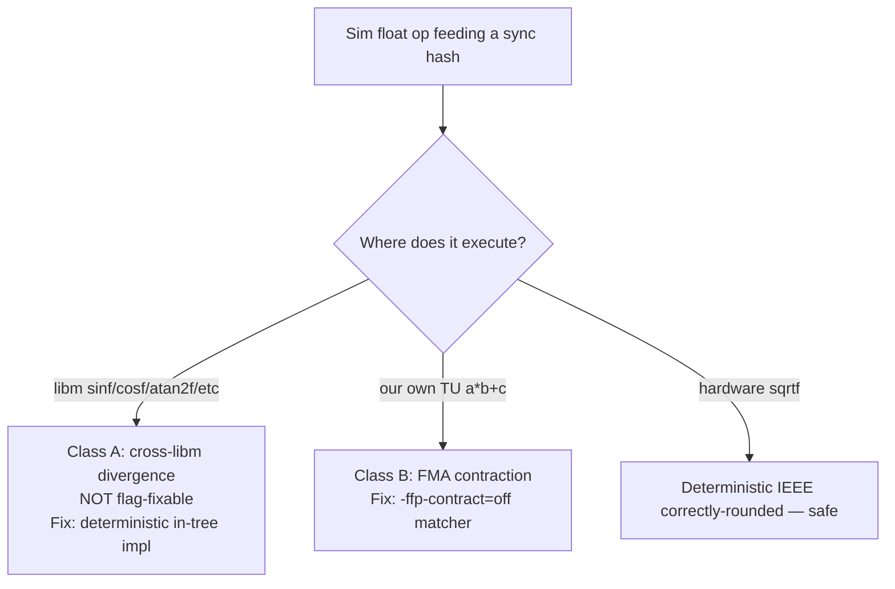

# Cross-ISA float determinism — netplay playbook

Reusable reference for N64 decomp netplay mods: why aarch64↔x86_64 (and bionic↔glibc) peers diverge on matched inputs, how to classify the failure, and what to fix.

**Related fixes:** [netplay_cross_isa_determinism_2026-05-27.md](bugs/netplay_cross_isa_determinism_2026-05-27.md), [netplay_cross_isa_libm_trig_2026-06-04.md](bugs/netplay_cross_isa_libm_trig_2026-06-04.md), [netplay_thrown_item_world_pose_fma_2026-05-30.md](bugs/netplay_thrown_item_world_pose_fma_2026-05-30.md), [netplay_link_bomb_rollback_2026-05-29.md](bugs/netplay_link_bomb_rollback_2026-05-29.md).

---

## Two-class taxonomy

Every float that feeds a rollback / frame-commit sync hash must be classified before choosing a fix.

| Class | Mechanism | Compile-flag fix? | Fix |
|-------|-----------|-------------------|-----|
| **A — cross-libm** | `__sinf`/`__cosf` (etc.) resolve to **platform** `libm` (bionic vs glibc). Different algorithms → different last ULP. Quantize grid can **straddle** (peers snap to different cells). | **No** — math is in precompiled `libm.so` | Route to **one in-tree implementation** (decomp N64 polynomial, netmenu-gated). |
| **B — FMA contraction** | Clang/GCC may fuse `a*b+c` to one FMA on aarch64 while x86_64 uses two rounded ops. | **Yes** — `-ffp-contract=off` on the TU | Add TU to matcher in `CMakeLists.txt`. |
| **Safe — hardware sqrt** | `sqrtf` is IEEE-754 correctly-rounded on both ISAs. | N/A | Usually no action; still quantize at hash boundaries if needed. |

**Rule:** Any transcendental on a **sync path** must run a **single in-tree implementation**. Any `a*b+c` on a **sync path** must compile with **contraction off**.

---

## Detection signature

Typical cross-ISA desync from float drift:

1. **Matched inputs** at frame commit (`inp` token agrees).
2. **Coarse tokens may still match** (`world`, `rng`, `eff`) while a finer token splits (`figh`, `item`, `map`).
3. **Same-ISA peers stay clean** (Linux↔Linux OK; Android↔Linux fails).
4. **First measurable fork** often in velocity / collision / orientation after trig or matrix math (e.g. PK Thunder jibaku `vel_air` differs in the 4th decimal before quantize snap).
5. **Rollback reanchor does not reconverge** — replay re-seeds the same nondeterminism.

Use synctest + `SSB64_NETPLAY_SIM_F32_QUANTIZE=0` on **both** peers only to **reproduce** drift (not for production).

---

## Matcher coverage checklist (`CMakeLists.txt`)

When adding sim code that produces floats in sync hashes, verify the TU is in the `-ffp-contract=off` foreach (netmenu only):

| Pattern | Purpose |
|---------|---------|
| `/decomp/src/ft/` | Fighters (`figh`) |
| `/decomp/src/ef/` | Effects (`eff`) |
| `/decomp/src/wp/` | Weapons (`wpn`) |
| `/decomp/src/it/` | Items (`item`) |
| `/decomp/src/mp/` | Map / collision |
| `/decomp/src/lb/` | Shared vector math |
| `/decomp/src/gm/` | Camera + world-pose matrix |
| `/decomp/src/gr/` | Stage sim (Sector Arwing, etc.) |
| `/decomp/src/netplay/` | Relocated netplay TUs |
| `/decomp/src/sys/objanim.c$` | Anim scalars in hash |
| `/decomp/src/sys/utils.c$` | `syUtilsArcTan` polynomial (jibaku angle) |
| `/decomp/src/sys/vector.c$` | Dot / angle helpers |
| `/decomp/src/libultra/gu/sinf.c$`, `cosf.c$` | N64 polynomial (double FMA internally) |
| All `port/net/**` | Port netmenu layer |

**Known non-sync (render-only):** `sys/matrix.c` rotation builders, `guMtxCatF`, `guMtxXFMF` — consume synced pose, emit GBI; nothing writes back to hash. Optional to match; not required for sync.

**Historical matcher gaps (fixed 2026-06-04):** `netplay/lb/` (Link bomb), single-file `gmcamera.c` only (item throw world pose), missing `gr/`, missing libm trig sources.

---

## Class A: libm routing (IDO builtins)

N64 decomp uses `__sinf` / `__cosf` (IDO builtins), not ISO C `sinf`/`cosf` directly.

**Port default (offline):** [port/stubs/libc_compat.c](../port/stubs/libc_compat.c) wraps to system `sinf`/`cosf`.

**Netmenu fix:** Compile [decomp/src/libultra/gu/sinf.c](../decomp/src/libultra/gu/sinf.c) and [cosf.c](../decomp/src/libultra/gu/cosf.c); gate **out** the libc_compat wrappers to avoid duplicate symbols. Provide `__libm_qnan_f` (declared in `PR/guint.h`, otherwise only in uncompiled MIPS `libm_vals.s`).

Offline binary (`SSB64_NETMENU=OFF`) unchanged — still system libm.

---

## Class B: quantize grid (secondary)

`syNetplayQuantizeF32` (1/65536 grid) runs at sim boundaries and in `syNetSyncHashF32`. It **merges** small drift when both peers land in the **same** grid cell; it **cannot** fix cross-libm or straddle-at-midpoint cases.

Hash-only quantize (`syNetplayQuantizeF32ForRollbackHash`) is for snapshot verify boundaries — raw blobs, quantize at hash save/verify only (see map hash parity docs).

---

## Workflow for new netplay features

1. Trace float outputs into sync hash (`syNetSyncHash*`, frame-commit tokens, snapshot blobs).
2. Classify each op (libm vs our-TU vs sqrt).
3. Class A → in-tree impl or netmenu-only deterministic path.
4. Class B → add TU to matcher; verify in `compile_commands.json`.
5. Soak cross-ISA with gate diag; confirm no FC split with matched inputs.
6. Document under `docs/bugs/<slug>_<YYYY-MM-DD>.md` and link here if it extends the taxonomy.

---

## Offline vs netmenu (policy)

Per [decomp_upstream_divergence_audit_2026-06-03.md](decomp_upstream_divergence_audit_2026-06-03.md): deterministic libm routing is **netmenu-only**. Offline stays JRickey release parity (system libm). Netmenu offline modes inside the netmenu binary use N64 polynomial trig — documented deviation, more ROM-faithful than bionic/glibc split.
