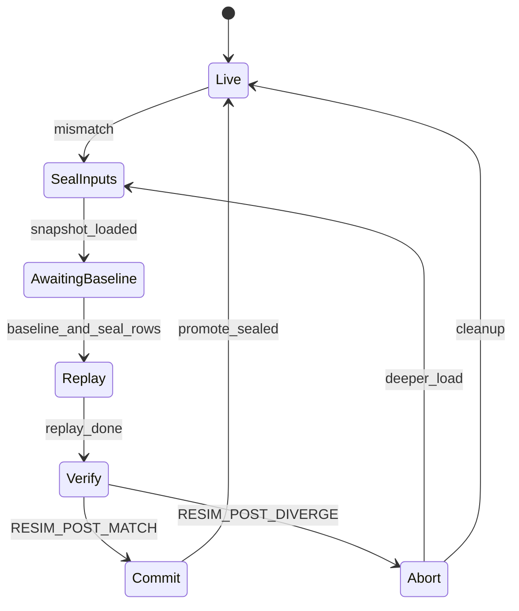

# Netplay rollback refactor contracts (GGPO / GekkoNet alignment)

This note tracks the **target** rollback architecture during the GGPO-style refactor. It complements [`netplay_rollback_test_matrix.md`](netplay_rollback_test_matrix.md) and the per-subsystem matrix in [`netplay_rollback_snapshot_coverage.md`](netplay_rollback_snapshot_coverage.md).

## Authoritative sim tick

- **`syNetInputGetTick()`** is the only sim step counter during VS.
- Wire labels use **`sim + D`** (committed input delay). See [`netplay_timebase_authority.md`](netplay_timebase_authority.md).

## Rollback semantics boundary (forward sim)

**Rule:** rollback/netplay policy must not mutate live forward sim outside an active netplay VS session.

- **`syNetplayRollbackSemanticsActive()`** — TRUE when `syNetPeerIsVSSessionActive()` or `syNetRollbackIsResimulating()`.
- **`syNetplaySimQuantizeActive()`** — defers to rollback semantics (F32 grid + canonicalize paths).
- **Port safety** (stale GObj guards, LP64 fixes) may stay under `#ifdef PORT` without the session gate.
- **Rollback policy** (spawn/cull/reacquire helpers, delay re-arm, collide guards, sanitize-on-forward-tick) must gate on `syNetplayRollbackSemanticsActive()` in decomp procs, or no-op inside `port/net/sys/netrollbacksnapshot.c` mutators.
- **Snapshot apply/sanitize** in `port/net/sys/*` runs only during rollback load/resim within a net session — no gate needed on forward offline ticks.

Offline VS, 1P, Training, and netmenu offline classic VS (no active peer session) keep vanilla decomp behavior.

### Decomp coding standard (enforced in CLAUDE.md)

**Dual boundary — compile and runtime are both required:**

| Layer | Wrapper | Purpose |
|-------|---------|---------|
| Port | `#ifdef PORT` | LP64, null guards, reloc — not netplay |
| Compile | `#if defined(PORT) && defined(SSB64_NETMENU)` | Net headers/calls absent from `SSB64_NETMENU=OFF` binary |
| Runtime | `syNetplayRollbackSemanticsActive()` | Policy only during active VS / resim inside netmenu binary |

```c
#if defined(PORT) && defined(SSB64_NETMENU)
/* SSB64_NETMENU: stripped from offline builds. Runtime: active VS/resim only. */
/* Netplay rollback only: <one-line why>. See docs/bugs/<slug>.md. */
if (syNetplayRollbackSemanticsActive() != FALSE)
{
    ...
    return; /* Mario-style: netplay path then vanilla below */
}
#endif
/* Vanilla forward sim */
```

Reference implementations: `ftmariospecialn.c` (`ProcAccessory`), `ftnessspecialhi.c` (PK Thunder), `gryamabuki.c` (tower gate).

**Yamabuki (Saffron) tower gate (2026-06-02):** forward-sim rollback policy in `gryamabuki.c` gates on `syNetplayRollbackSemanticsActive()`. Includes live-monster spawn guard (netplay only — fixes offline 1P second-spawn regression), spawn egress wait, held-pose presentation sync, `BeginAnimOpen`/`Close` paths, and manual anim stepping. Offline uses vanilla `AddAnimOpen`/`AddAnimClose`, standard collision clamp at 960, and plain `gcPlayAnimAll` per tick. Rollback restore exports remain apply-path only.

**Stage hygiene pass (2026-06-02):** `grjungle.c` gates barrel DObj repair/reestablish on `syNetplayRollbackSemanticsActive()` (offline vanilla anim paths). `grsector.c`, `grhyrule.c`, `grzebes.c` quantize blocks use `#ifdef PORT` + `syNetplaySimQuantizeActive()` (offline no-op). `gryoster.c` gates zero-altitude cloud recovery on rollback session. All listed in `_SSB64_DECOMP_NETINCLUDE_SOURCES` for offline builds.

**Fighter/item hygiene pass (2026-06-02):** Kirby Copy Mario/Luigi, Pikachu Thunder Jolt, Kirby Copy Pikachu, and Pikachu Thunder (down+B start) use Mario-style `ProcAccessory` / spawn branching (`syNetplayRollbackSemanticsActive()` + vanilla fallthrough). Yoshi egg throw, Samus/Kirby Copy Samus charge shot reacquire/cull, and held-item weapon dedup (Star Rod, Fire Flower, L-Gun) gate rollback policy on active session. Snapshot mutators `syNetRbSnapCullYoshiChargeEggsForFighter` and `syNetRbSnapHeldItemWeaponNeedsSpawn` no-op offline as defense in depth.

**Compile-boundary enforcement (2026-06-02):** Reverted net rollback blocks from `#ifdef PORT` to `#if defined(PORT) && defined(SSB64_NETMENU)` repowide (fighters, stages, items, TaruCann/Twister, collision/anim quantize). Runtime policy still gates on `syNetplayRollbackSemanticsActive()`. Offline builds (`SSB64_NETMENU=OFF`) no longer link `netrollbacksnapshot.c` or other rollback TUs; `_SSB64_DECOMP_NETINCLUDE_SOURCES` shrunk to shell/debug TUs only.

## Input timeline (target)

Each remote human slot should expose one logical row per sim tick with explicit state:

| State | Meaning |
|-------|---------|
| `missing` | No row usable for sim or strict admission |
| `predicted` | Speculative remote input used for forward sim |
| `confirmed` | Authoritative remote packet stored for this wire/sim row |
| `incorrect_prediction` | Confirmed input disagreed with what was published; rollback should start here |

**Implemented (2026-05-18):**

- **Unified resim reconcile** — `syNetInputRollbackReconcileResimSpan`: remote slots = wire-confirmed; local slots = transmitted (else non-predicted published per tick). Called from `syNetRollbackBeginResim`, **`syNetInputRollbackReconcileAfterResimCompleted`** (end of forward resim), and **`syNetInputRollbackReconcilePublishedCommitWindow`** (before each frame-commit token build).
- **Conservative remote button prediction** — remote human slots: hold-last sticks, buttons default 0 (`SSB64_NETPLAY_PREDICT_REMOTE_BUTTONS_HOLD=1` for legacy hold-last).
- **No patch-only correction (2026-05-18)** — significant predicted-remote mismatch queues deferred symmetric resim; no live `PatchPublishedFromRemoteConfirmed` on that tick. Prediction recovery disabled unless `SSB64_NETPLAY_PREDICTION_RECOVERY=1`. Digital tap patch-without-rollback disabled during active rollback.
- **Symmetric resim execution** — wire-locked `target_tick` when symmetric follower is active (no per-peer `highest_remote + D + 1` shrink); post-load **baseline gate** (`figh`/`world`/`item`/`rng`) before forward replay; skip snapshot save during `resim_pending` / episode cooldown; cosmetic RNG reset on snapshot load; confirmed-only remote rows during resim (no predicted fallback). **Forward replay pacing (2026-06-01):** after baseline gate opens, spans ≤ `SSB64_NETPLAY_ROLLBACK_MAX_BURST_TICKS` (default 24) replay synchronously via `syNetRollbackAdvanceResimBudgetEx`; deeper spans use per-frame budget (`SSB64_NETPLAY_ROLLBACK_RESIM_TICKS_PER_FRAME`, default 12). See [`netrollback_burst_resim_2026-06-01.md`](bugs/netrollback_burst_resim_2026-06-01.md).
- **Symmetric peer notices** — follower resim on by default when rollback is active (`SSB64_NETPLAY_ROLLBACK_SYMMETRIC=0` disables; `SSB64_NETPLAY_ROLLBACK_SYMMETRIC_DIAG=1` log-only).
- **Resim RNG verify** — log after each completed resim by default (`SSB64_NETPLAY_RESIM_RNG_VERIFY=0` disables).
- **Resim coordination transport (2026-05-18)** — while `ResimPending`, peers still run `ReceiveRemoteInput` + `SendLocalInput` + `ROLLBACK_BASELINE` + `ROLLBACK_SYNC` (type 24) so symmetric notify and baseline echo are not blocked. Exception to the “no network during forward resim” target below.
- **Rollback episode** — `SYNetRollbackEpisode` tracks mismatch/load/target and phase (`AwaitingBaseline` / `ForwardResim`); syncs to legacy `ResimPending` / baseline gate flags.
- **Unified episode FSM (2026-05-20)** — **Default on** via [`port/net/sys/netrollback_episode.c`](../port/net/sys/netrollback_episode.c): `Live → SealInputs → AwaitingBaseline → Replay → Verify → Commit|Abort`. Sealed input table is the sole replay read set; per-tick replay log drives `RESIM_POST` input digest; live sim cap derived from FSM phase (not min of six legacy cap sources). `SSB64_NETPLAY_ROLLBACK_EPISODE_FSM=0` restores legacy resim input path for bisect.
- **EPISODE_SEAL_ROWS (2026-05-20)** — `SYNETPEER_PACKET_EPISODE_SEAL_ROWS` (26): after seal, each peer sends locally-authoritative sealed rows for `[mismatch, target)`; peer overwrites remote slots in `sealed[]`. `Replay` gated on baseline match **and** all required peer seal rows received (retransmit with `ROLLBACK_BASELINE`). Bundled with episode FSM when enabled.
- **Remote-human analog authority (2026-05-20)** — When episode FSM is on, remote-human live sim and published history use wire-confirmed / hold-last only (`syNetInputResolveRemoteHumanAuthoritativeFrame`); no optimistic `analog_onset_predict` in authoritative paths. Precursor to full [`netinput_timeline.c`](../port/net/sys/netinput_timeline.c) rewrite. See [`netinput_remote_analog_authority_2026-05-20.md`](bugs/netinput_remote_analog_authority_2026-05-20.md).

## Unified episode FSM (target, gated)



| Phase | Live sim cap | Input authority |
|-------|----------------|-----------------|
| `SealInputs`…`Verify` | `target` | Sealed span only (`syNetRollbackEpisodeGetSealedFrame`); remote slots from peer `EPISODE_SEAL_ROWS` |
| `Live` + peer convergence | `peer_target + slack` | Normal ingress |
| `Live` | none (hr frontier) | Normal |

**Out of scope (longer term):** see [`netplay_rollback_test_matrix.md`](netplay_rollback_test_matrix.md#out-of-scope-longer-term) and deferred roadmap below.

**Deferred roadmap (not in remote-analog-authority PR):**

| Track | Notes |
|-------|--------|
| **P2P snapshot byte exchange** | Peers load local ring slots at `load_tick`; `ROLLBACK_BASELINE` digest agreement is the substitute until inputs+span fail to converge. |
| **Full `netinput_timeline.c` rewrite** | Explicit per-tick `missing` / `predicted` / `confirmed` / `incorrect_prediction`; gap-fill admission-only. Remote analog authority is a precursor, not the full rewrite. |
| **Mid-Replay seal-row patch / re-run replay** | Late peer seal rows use `reseal_deeper` / Abort→SealInputs, not patching `sealed[]` mid-forward-resim. |
| **Default-on `EPISODE_FSM`** | Separate rollout PR after combined soak pass. |

**Also deferred:** disabling symmetric notify for pure independent GGPO; hard-blocking resim on anim-only `LOAD_HASH_DRIFT`.

**Transitional / unsafe today:**

- **`nSYNetInputSourceRemoteGapFilled`** — hold-last synthetic wire rows for strict admission. Must **not** be treated as confirmed authority for rollback mismatch or resim seeding once timeline refactor lands.
- **Published history vs remote ring double-scan** — rollback compares rings; target is `incorrect_prediction` markers on the timeline.

## Rollback trigger (target)

- **Local and input-driven** (GekkoNet `GetMinIncorrectFrame` style): rollback when confirmed input proves a prior prediction wrong.
- **Peer symmetric rollback notices** — **authoritative episode contract** (2026-05-19): initiator locks `(epoch, load, mismatch, target)` in `ROLLBACK_SYNC` (type 24); follower executes that tuple verbatim (`SSB64_NETPLAY_ROLLBACK_EPISODE_AUTHORITY=0` restores legacy re-derivation). `RESIM_POST_MATCH` releases peer epoch. Not a substitute for independent per-peer mismatch detection until that path is proven to pick the same span without notify.

**Implemented (2026-05-27) — minimum correction tuple + 4p hooks:**

- **`syNetRollbackComputeInputCorrectionTuple`** — unified `(player, mismatch, load_hint, target)` for wire, episode FSM, and post-resim followup; `hint_player=-1` uses global earliest incorrect across all remote-human slots.
- **Per-slot `PendingEpisodeBySlot[MAXCONTROLLERS]`** — `ROLLBACK_SYNC` notify merge per slot; one resim still loads whole sim from global-min mismatch when initiating locally.
- **4-player lab contract** — `SSB64_NETPLAY_REMOTE_SLOTS=1,2,3` on host stub; future bootstrap `netplay_sim_slot_local_hw[4]` (not wired). See [`bugs/netrollback_minimum_correction_tuple_2026-05-27.md`](bugs/netrollback_minimum_correction_tuple_2026-05-27.md).

## Resimulation (target)

- **Pure sim step**: publish historical inputs + `scVSBattleFuncUpdate` battle sim only.
- **Excluded during forward resim sim loop**: fresh HID, adaptive delay bumps, full `syNetPeerUpdate` gameplay path.

**Current (2026-05-18):** Resim branch pumps coordination I/O only (`ReceiveRemoteInput`, `SendLocalInput`, baseline/sync). Forward resim still uses `scVSBattleFuncUpdateBattleSimOnly()`. `syNetInputFuncRead()` may still run inside battle update paths.

## Snapshot restore (target)

- **All-or-nothing**: failed load must not leave a partially applied world.
- **`LOAD_HASH_DRIFT`** after apply is a **hard failure** until restore is complete (item translate fix reduced one class; fighter/anim gaps may remain).
- Ring depth **`SSB64_NETPLAY_ROLLBACK_SNAPSHOT_FRAMES`** must cover practical rollback span (scan window 256 vs default ring 32 is a known sizing tension).

## Hash partition map (integrity-first)

All digests are **current-frame snapshots** (no trajectory). Consumers must not compare hashes across different functions.

| Consumer | Fighter | Item |
|----------|---------|------|
| NetSync validation log | `syNetSyncHashBattleFighters()` (light) | `syNetSyncHashActiveItemsForRollback()` — XOR fold, **sorted by `gobj_id`** |
| Frame-commit token (enforcement) | `syNetSyncHashBattleFightersFull()` | same rollback item hash |
| Rollback baseline / resim-complete / `RESIM_POST` | `syNetSyncHashBattleFightersFull()` | same rollback item hash |
| Typed snapshot ring | per-slot subsystem hash in blob | full `SYNetRbSnapItemBlob` in [`port/net/sys/netrollbacksnapshot.c`](../port/net/sys/netrollbacksnapshot.c) |

**Order dependence:** item rollback hash XORs per-item folds in `gobj_id` order. Snapshot restore guarantees per-`gobj_id` state, not linked-list order — post-load sim can reorder the list before hash time.

**Optional probe:** `SSB64_NETPLAY_VALIDATION_DUAL_HASH=1` logs when light vs Full fighter hashes differ at NetSync validation (after item bisect).

**Cross-peer resim boundary:** `SYNETPEER_PACKET_RESIM_POST` (type 25) carries `(epoch, load, mismatch, target)` + `figh/item/rng/input_digest`; compare when local forward resim completes and keys match pending peer token.

## Log signatures (regression)

| Log | Interpretation |
|-----|----------------|
| `LOAD_HASH_DRIFT` | Snapshot apply did not reproduce saved hashes — **stop session** (target) |
| `ROLLBACK_IDENTITY_DRIFT` | Resim with unchanged confirmed input did not reproduce pre-resim hashes |
| `REMOTE_CONFIRMED_CONFLICT` | Two authoritative confirmed packets disagree on same wire tick |
| `remote_gap_fill` | Synthetic hold-last wire row (admission-only target) |
| `peer symmetric rollback` | Peer notice queued resim (transitional gameplay contract) |
| `ROLLBACK_SYNC_SEND` / `ROLLBACK_SYNC_RECV` | Dedicated symmetric rollback notice packet (type 24) |
| `RESIM_BASELINE_ECHO` | Passive peer echoed baseline digest without local resim episode |
| `RESIM_POST_MATCH` / `RESIM_POST_DIVERGE` | Cross-peer post-resim digest handshake |
| `FRAME_COMMIT_PAIRING_FAIL` | Same `frame_id` but `\|tick_anchor_local - tick_anchor_peer\| > 1` |
| `FRAME_COMMIT_DIAG` | Shutdown counter summary (`fc_sent`, `fc_compared`, …) |
| `STRICT MISS (R)` | Strict admission stall on missing exact wire row |

## Related bug write-ups

See [`docs/bugs/README.md`](bugs/README.md) entries: `netrollback_symmetric_rollback`, `netrollback_prediction_recovery_storm`, `netrollback_strict_wire_gap_stall`, `netrollback_rng_item_identity_drift`, `netrollback_remote_confirmed_conflict`.
