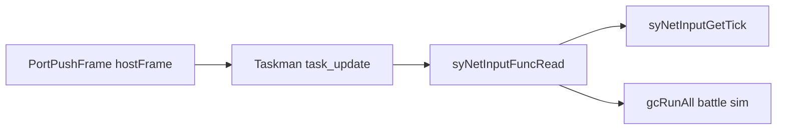

# netplay_taskman_simtick: taskman vs sim tick vs host push

This document defines how **local engine driving**, **netplay sim time**, and **frame pacing** relate. See also [`netplay_architecture.md`](netplay_architecture.md), [`netplay_pacing.md`](netplay_pacing.md).

## Simulation authority (rollback frame index only)

**Neither Taskman nor VI / presentation defines simulation time.** Both are local execution mechanics: variable across machines, sensitive to OS load, threading, and GPU stress. Choosing “Taskman is bad, so use VI instead” only swaps one nondeterministic driver for another; **neither** is a valid authority for indexing inputs, stepping gameplay RNG, or defining rollback time.

**Single authority (GGPO-style):** the **logical simulation frame index** — here `syNetInputGetTick()` after each fully completed `scVSBattleFuncUpdate`. Peers agree on inputs **per index**; resim replays `Sim(State_t, Inputs_t, RNG_t)` forward. Taskman and the render / VI loop only decide **how often** the process wakes up to pump ingress, run slices, or present; they must **not** be used as implicit frame counters for anything that affects `State_{t+1}`.

**Invariant:**

\[
\text{State}_{t+1} = \text{Sim}(\text{State}_t, \text{Inputs}_t, \text{RNG}_t)
\]

- **`t`** — rollback frame index only (not `dSYTaskmanUpdateCount`, not host push count, not wall clock).
- **`Inputs_t`** — **Frame-addressed and frozen before** `Sim_t` begins: `Inputs_t[player]` is the immutable buffer for `(t, player)` that the sim step **reads only** (GGPO-style fixed frame buffer). It is **not** “whatever HID read ran on this VI frame,” not arrival-order–bound, and not execution-order–bound within the tick. Network jitter fills **future** indices; it must not **rebind** or **mutate** the slice for the tick that is already simulating.
- **`RNG_t`** — Gameplay PRNG **consumed during** `Sim_t` (mutable stream); session seed is initial state. Optional deterministic `RandTime` paths must mix **`t`** (and similar sim-local counters), not presentation timing. **Do not** tie RNG stepping or **which** input row is `Inputs_t` to VI ticks or Taskman iteration counts.

### Inputs vs RNG (same index, different mutability)

Same rollback frame index anchors both. **Inputs** define what the machine *did* on that frame from the peers’ contract and must stay **read-only** for the whole sim pass. **RNG** *evolves inside* that pass as game code calls into it. Violating \(\forall t:\ Inputs_t \text{ immutable during } Sim_t\) loses rollback correctness immediately — you get “identical wire stream, different frame interpretation,” slot drift, and late divergence (e.g. guest slot / `p1` windows) worse than simple packet loss.

**Forbidden (input plane):** Binding which sample is `Inputs_t` to Taskman passes or VI; updating “the current frame’s” inputs during GC-only / skew / stall **slices** as if that were a sim step; late-binding when subsystems run; republishing from ingress **mid–`gcRunAll`**.

**Separation of responsibilities (three layers):** (1) **Input layer** — collect packets, assign to `(frame, player)`, freeze the buffer for `t` before sim. (2) **Simulation layer** — read-only `Inputs_t`, consume `RNG_t`, produce `State_{t+1}` deterministically. (3) **Presentation layer** — VI / rendering; **no** write-back into sim input or sim state.

**Why logs can show late `figh` with stable `mph` / traversal:** that pattern fits **inconsistent consumption of RNG or hidden state inside the sim**, or **phase-visible input** (when a slot becomes “the” `Inputs_t` for `t` differs across peers), not “wrong clock between peers.” If VI or Taskman were the primary desync axis, you would more often see broad tick drift, unstable traversal, or early global divergence — not a typical “fighters fork mid-match while map hash holds” fingerprint.

**One-line rules:** You do not fix determinism by picking a “better clock”; you remove clocks from simulation authority and anchor **everything** that affects `State_{t+1}` to the **rollback frame index** and agreed inputs. **Inputs define the frame (frozen before sim); RNG evolves within the frame; neither may depend on execution timing — only on `t`.**

## Terms

| Name | Symbol / API | Meaning |
|------|----------------|---------|
| **Taskman** | `dSYTaskmanUpdateCount`, `scene_update` driver | Local engine driver for game-tic messages; **not** comparable across two PCs. |
| **Sim tick** | `syNetInputGetTick()` | Rollback / netplay **logical time index**; advanced once per completed `scVSBattleFuncUpdate` (`syNetInputAdvanceAuthoritativeSimTick`), not from `syNetInputFuncRead` alone (`port/net/sys/netinput.c`). |
| **Host push** | `PortPushFrame`, `port_get_push_frame_count()` | SDL / display refresh cadence; **not** authoritative for simulation. |

**Principle:** Authoritative battle state — global gameplay PRNG (`syUtilsRand*`), `gMPCollisionUpdateTic` (map / yakumono “world” progression), and anything that must match across peers — should advance **one coherent step per completed sim tick** on both machines, not per host frame or per arbitrary taskman iteration when those diverge (skew hold, barrier freeze, display decouple).

The diagram is **causal wiring on one machine** (host push eventually schedules work that calls `FuncRead` and may run sim). It is **not** a claim that `syNetInputGetTick()` is derived from Taskman or VI as a timebase — the tick counter advances only in `syNetInputAdvanceAuthoritativeSimTick()` after a full battle update, independent of how many presentation or taskman iterations occurred.

### Phase 6 skew and `gcRunAll`

When **skew pacing** holds sim (suppress scene), the net slice can run **without** a full `gcRunAll` step for that controller pass. **Neither** `syNetInputGetTick()` nor **`gMPCollisionUpdateTic`** advance on that iteration; only ingress / net transport runs until skew clears.

## World seed / world tick in this tree

- **`gMPCollisionUpdateTic`** (`decomp/src/mp/map.h`, `u16`): advanced at the end of `mpCollisionPlayYakumonoAnim` and in `mpCollisionAdvanceUpdateTic` (`decomp/src/mp/mpcollision.c`), driven from stage display / GObj processes (e.g. `decomp/src/gr/grdisplay.c`). Included in rollback / NetSync as map-side state (`port/net/sys/netrollback.c`, hashed in `syNetSyncHashMapCollisionKinematics` in `port/net/sys/netsync.c`).
- **Gameplay PRNG:** `syUtilsRand*` — LCG on `sSYUtilsRandomSeed` (`decomp/src/sys/utils.c`). Session seeds for netplay are set via `syUtilsSetRandomSeed` from match metadata (`port/net/sys/netpeer.c`).
- **`syUtilsRandTime*`** — historically sampled **`osGetTime()`** (wall / monotonic clock). On the PC port that is **nondeterministic across peers** if called during gameplay. Deterministic VS behavior is optional via **`SSB64_NETPLAY_DETERMINISTIC_RANDTIME=1`** (see below).

## Inventory: `syUtilsRandTime*` call sites

`grep` under `decomp/src`: **`syUtilsRandTime*` appears only in menus / opening**, not under `ft/`, `it/`, `wp/`, `gr/`, `mp/`, or `sc/`.

| Area | Files | Notes |
|------|-------|--------|
| **RandTime** | `mv/mvopening/mvopeningroom.c`; `mn/mnplayers/mnplayers1ptraining.c`, `mnplayersvs.c`; `mn/mnmaps/mnmaps.c`; `mn/mncommon/mntitle.c`; `mn/mndata/mncharacters.c` | Menu / opening only — character color picks, VS/training fighter picks, map UI. |
| **`syUtilsRand*` (non-Time)** | Heavy use in `ft/`, `it/`, `wp/`, `gr/`, `sc/` (e.g. AI `ftcomputer.c`, items, stage hazards, 1P scenes) | Driven by global LCG during battle / scenes — **not** wall-clock RandTime. |
| **`mp/`** | *(no `syUtilsRand` matches)* | Map collision uses other state; world tic is `gMPCollisionUpdateTic`. |

**`gMPCollisionUpdateTic` increments:** `mpCollisionPlayYakumonoAnim` (after bounds update) and `mpCollisionAdvanceUpdateTic`; reset in map init (`mpcollision.c`).

## Deterministic RandTime (VS netplay, opt-in)

When **`SSB64_NETPLAY_DETERMINISTIC_RANDTIME=1`** **and** all of:

- `syNetPeerIsVSSessionActive()`
- `syNetPeerCheckBattleExecutionReady()`
- `gSCManagerSceneData.scene_curr == nSCKindVSBattle`

then `syUtilsRandTimeUChar`, `syUtilsRandTimeFloat`, and `syUtilsRandTimeUCharRange` use a **deterministic mix** of `syNetInputGetTick()`, the current PRNG seed, and a per-call counter — **not** `osGetTime()`.

Default **`SSB64_NETPLAY_DETERMINISTIC_RANDTIME` unset or `0`**: unchanged vanilla behavior (menus retain wall-clock RandTime).

## MP tic telemetry (opt-in)

When **`SSB64_NETPLAY_ASSERT_MP_TIC=1`**, periodic NetSync validation logs an extra line:

`SSB64 NetSync: mp_tic_diag sim_tick=… mp_collision_tic=…`

Use this to compare **sim tick** vs **`gMPCollisionUpdateTic`** across two peers or vs rollback resim. Equality of raw values is **not** guaranteed (different counters); the goal is spotting **unexpected divergence** between peers or vs saved rollback needles.

## Execution trace: sim-tick phase (skew / desync diagnosis)

This section is the **ordered call graph** for one VS battle step on Linux UDP, and where **sim-tick phase skew** (same UDP payloads, different **resolve tick** or **authoritative sim-tick** cadence) can appear.

### One taskman game tick (`port/net/sys/taskman.c`)

For VS battle, `syTaskmanCommonTaskUpdate` runs:

1. **`sSYTaskmanFuncController()`** → **`syNetInputFuncRead`** (`port/net/sc/sccommon/scvsbattle.c` wires this).
2. **`syNetInputFuncRead`** (`port/net/sys/netinput.c`), in order (Linux UDP):
   - **Active VS (`syNetPeerIsVSSessionActive`)**: **`syNetPeerUpdateBattleGate()`** — recv + delay ramps + barrier + bind/exec sync; if **`syNetPeerCheckBattleExecutionReady()`** is false, **return without publish** (no authoritative frame for this task iteration).
   - **Inactive**: **`syNetPeerPumpIngressBeforeInputRead()`** (local/offline parity).
   - **Rollback resim**: skip gate + stall/skew admission; publish from history as before.
   - Snapshot HID once per **`syNetInputGetTick()`** (skew/stall can repeat FuncRead before **`syNetInputAdvanceAuthoritativeSimTick`**).
   - **Stall-until-remote** (env): if remote ring missing current tick → set suppress, **return without publish**.
   - **Skew pacing**: if lead cap exceeded → set suppress, **return without publish**.
   - **Resolve + publish** every slot for **current** `tick = syNetInputGetTick()` only after passing admission above.
   - **`syNetInputAdvanceAuthoritativeSimTick`** does **not** occur here; it runs after **`scVSBattleFuncUpdate`** completes.
3. **`syNetInputTakeSuppressSceneUpdate()`** — if TRUE: **`scVSBattleFuncUpdateSkewPacingNetSlice`** only; else **`scVSBattleFuncUpdate`**.

So **phase skew** means: peer A completes a full **`scVSBattleFuncUpdate`** (and **`syNetInputAdvanceAuthoritativeSimTick`**) for step *T* while peer B **does not publish** (stall/skew) or runs only the pacing slice — divergent **`syNetInputGetTick()`** vs remote **`HighestRemoteTick`** / published history.

### One VS scene update (`scVSBattleFuncUpdate`, full path)

When skew suppression is **off**:

1. If **`syNetPeerCheckBattleExecutionReady()`** is FALSE → **return** immediately (ingress + barrier were already advanced in **`syNetInputFuncRead`** for active VS).
2. **`ifCommonBattleUpdateInterfaceAll`**, **`syNetReplayUpdate`** (when not resimming).
3. **`syNetPeerUpdate()`** which calls **`syNetPeerUpdateBattleGate()`**, then **`syNetPeerSendLocalInput()`**, adaptive delay step, **`syNetRollbackUpdate()`**.

Each taskman tick therefore runs **`UpdateBattleGate`** at least once in **`syNetInputFuncRead`** (active VS) and again inside **`syNetPeerUpdate`** when execution is ready — intentional extra UDP + barrier progress after sim.

### Battle exec sync (handshake only — does **not** snap `syNetInputTick`)

When **`SSB64_NETPLAY_BATTLE_EXEC_SYNC`** is enabled (default unless set to `0`):

- **Host** proposes **`agreed_sim_tick = syNetInputGetTick()`** at first eligible pump (`syNetPeerBattleExecSyncServiceTransport` → **`syNetPeerSendBattleExecSyncPacket`**).
- **Client** on first recv sets **`sSYNetPeerExecSyncAgreedTick`** and logs **`battle_exec_sync client latched tick=…`**; if **`agreed_tick != syNetInputGetTick()`** it logs **`battle_exec_sync client WARN host tick=… local_sim=…`** — **tick is not rewritten** to match.

So exec-sync proves **whether host/client saw the same frozen tick at latch time**; ongoing drift still depends on **admission outcomes** (stall/skew vs publish), **FuncRead early returns**, and **ingress ordering** relative to **`UpdateBattleGate`** in read.

### Host-frame pump (`port/gameloop.cpp`)

**`syNetPeerPumpBattleGateOnHostFrame`** runs **`syNetPeerUpdateBattleGate`** only while **`syNetPeerCheckBattleExecutionReady()` is FALSE** (`port/net/sys/netpeer.c`). During **live battle** (`execution_ready == TRUE`) this path is **inactive** — it does **not** explain mid-match skew by itself.

### Where to look when NetSync `all=` forks but **`delay=` matches**

| Hypothesis | Mechanism |
|------------|-----------|
| **Skew / stall asymmetry** | One peer **`ShouldHoldSimTickForSkewPacing`** or **remote ring stall** suppresses **`scVSBattleFuncUpdate`**; the other completes a full update and **`syNetInputAdvanceAuthoritativeSimTick`**. |
| **Ingress phase** | **`syNetPeerUpdateBattleGate`** / recv in **`syNetInputFuncRead`** (active VS) staged **different** remote-ring slots before publish for the **same** local `tick`. |
| **Delay ramp boundary** | **`GatherHistoryBundle`** uses **`sSYNetPeerInputDelay`** at send time; **`Apply*Delay*`** must run **before** the same tick’s resolve on **both** peers (`netpeer.c` / `netinput.c`). |

Cross-peer logs: compare **`battle_exec_sync`** WARN lines, **`udp_frame_trace`** **`cur_tick`** vs **`ticks=`**, and **`late`** / **`recv` vs `sent`** on the client.

## Verification checklist (manual)

1. Two-peer VS match (Linux UDP typical).
2. Enable **`SSB64_NETPLAY_TICK_DIAG=1`**, **`SSB64_NETPLAY_DESYNC_TRACE=1`** (or `2` for detail).
3. Compare **`mph`** (map collision kinematics hash) and **`figh`** (fighter hash) in NetSync lines; watch **`desync_trace`** transitions.
4. After enabling **`SSB64_NETPLAY_DETERMINISTIC_RANDTIME=1`**, re-run Brinstar / item-heavy scenes and confirm no unexpected **`mph`** drift vs baseline.
5. Rollback: trigger resim path and confirm **`mph`** / needles match live span for the same tick window (`syNetRollbackRunResim` diagnostics as usual).
